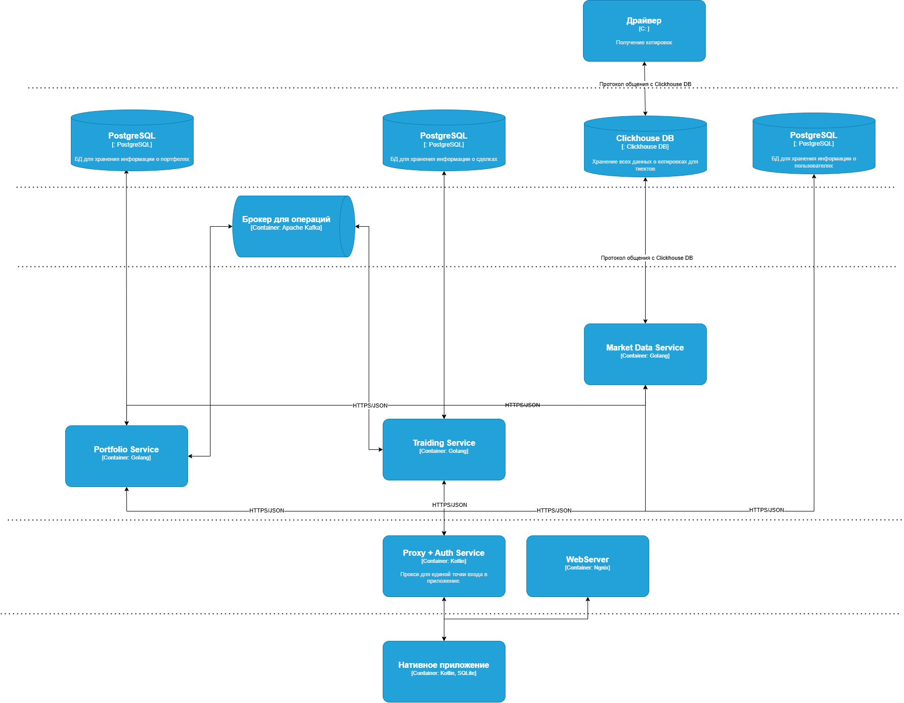
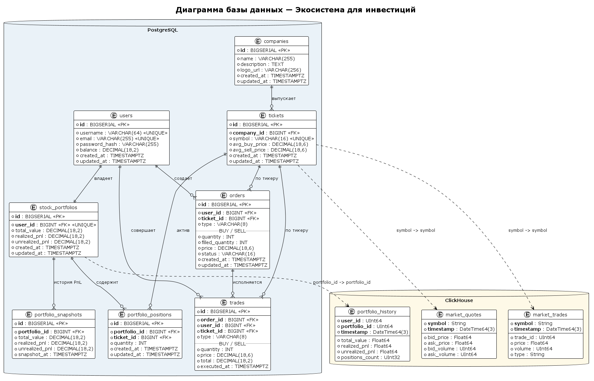
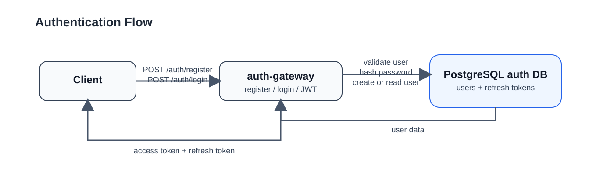
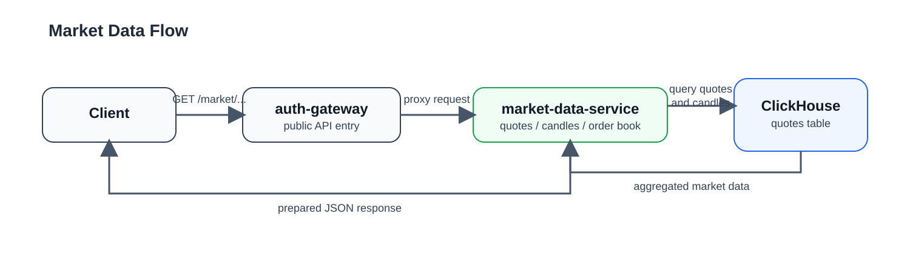
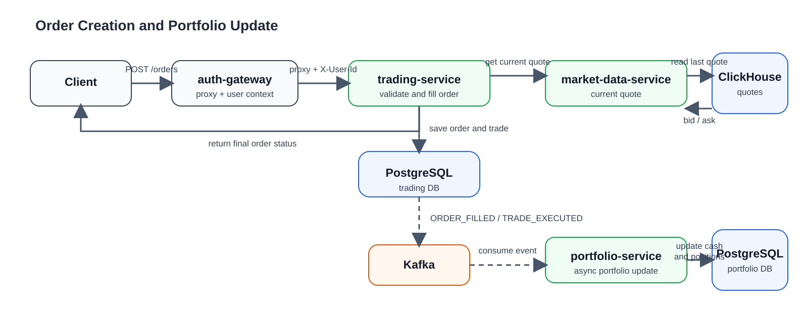
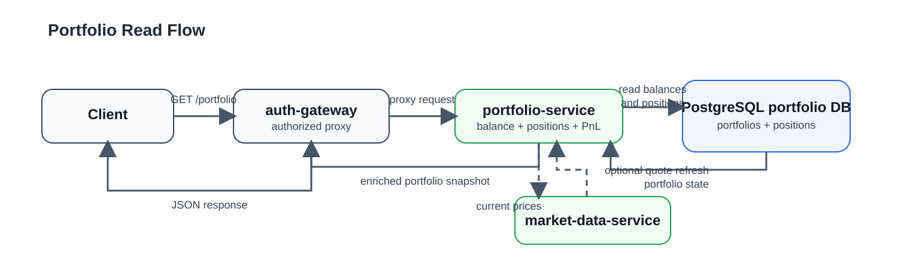
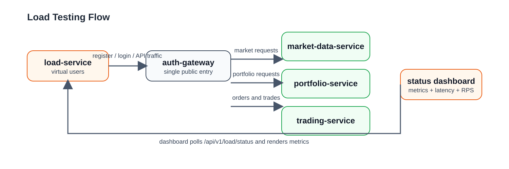

<br>

<p align="center">
Федеральное государственное автономное образовательное<br>
учреждение высшего образования<br>
«Национальный исследовательский университет ИТМО»
</p>

<br><br><br><br><br>

<p align="center">
<b>ОТЧЁТ</b><br>
по проектной работе<br>
<b>«Экосистема для инвестиций»</b><br>
по дисциплине<br>
«Разработка мобильных приложений»
</p>

<br><br><br><br><br><br><br>

<p align="right">
<b>Работу выполнили:</b><br>
Борисова Дарья Александровна<br>
Исупов Никита Александрович<br>
Молчанов Федор Денисович<br>
Николаенко Виктор Олегович<br>
Поленов Кирилл Александрович<br>
Пышкин Никита Сергеевич<br>
Чураков Александр Алексеевич<br>
Юсупова Алиса Ильясовна<br>
<br>
<b>Работу принял:</b><br>
Ключев Аркадий Олегович
</p>

<br><br><br><br><br>

<p align="center">
г. Санкт-Петербург<br>
2026
</p>

> Инструкция по сборке, запуску и тестированию: [DEVELOPMENT.md](DEVELOPMENT.md)

## Наблюдаемость (Observability)

Все сервисы — включая Android-клиент (`android-client`) — инструментированы через **OpenTelemetry** и отправляют распределённые трассы в **Jaeger**.

После запуска (`make setup`) открыть UI трассировки:

```bash
make telemetry
# → открывает http://localhost:16686 в браузере
```

Или перейти вручную: **http://localhost:16686**

В интерфейсе выбрать сервис из списка (`android-client`, `auth-gateway`, `market-data-service`, `portfolio-service`, `trading-service`) и нажать **Find Traces**.

# Оглавление

1. [Введение](#введение)
   1. [Актуальность проекта](#актуальность-проекта)
   2. [Цель проекта](#цель-проекта)
   3. [Задачи проекта](#задачи-проекта)
2. [Техническое задание](#техническое-задание)
   1. [Введение](#введение-1)
   2. [Назначение разработки](#назначение-разработки)
   3. [Состав продукта](#состав-продукта)
   4. [Структура бэкэнда](#структура-бэкэнда)
   5. [Функциональные требования](#функциональные-требования)
   6. [Нефункциональные требования](#нефункциональные-требования)
3. [Архитектура системы](#архитектура-системы)
   1. [Общая схема системы](#общая-схема-системы)
   2. [Архитектура базы данных](#архитектура-базы-данных)
   3. [Архитектура потоков данных](#архитектура-потоков-данных)
   4. [HTTP API сервисов](#http-api-сервисов)
4. [Описание реализации](#описание-реализации)
   1. [Auth Gateway](#auth-gateway)
   2. [Market Data Service](#market-data-service)
   3. [Trading Service](#trading-service)
   4. [Portfolio Service](#portfolio-service)
   5. [Load Service](#load-service)
   6. [Генерация и загрузка рыночных данных](#генерация-и-загрузка-рыночных-данных)
   7. [Сквозная идея реализации](#сквозная-идея-реализации)
5. [Тестирование](#тестирование)
   1. [Unit-тесты бэкенда](#unit-тесты-бэкенда)
   2. [Smoke- и integration-тесты backend-сервисов](#smoke--и-integration-тесты-backend-сервисов)
   3. [End-to-end тестирование через Auth Gateway](#end-to-end-тестирование-через-auth-gateway)
   4. [Нагрузочное тестирование](#нагрузочное-тестирование)
   5. [Тесты Android-клиента](#тесты-android-клиента)
   6. [Резюме](#резюме)
6. [Заключение](#заключение)
7. [Список литературы](#список-литературы)

<br><br><br><br><br><br><br><br><br>

# Введение

## Актуальность проекта

Многие люди имеют запрос на преумножение и сохранение своих сбережений, однако мир инвестиций имеет не самый низкий порог входа.

Платформа станет хорошим инструментом для пользователей, стремящихся войти в сферу инвестиций и торговли на финансовых рынках, обеспечивая все необходимые функциональные возможности без избыточного усложнения интерфейса.

Система предоставляет окружение для торговли акциями. Она дает пользователям возможность мониторинга графика акции и получения котировок в реальном времени, покупки и продажи акций и учет баланса. Тем самым пользователь получает все необходмые инструменты для формирования своего собственного инвестиционного портфеля.

## Цель проекта

Цель проекта - предоставить целевой аудитории удобную платформу для своего первого инвестиционного портфеля.

## Задачи проекта

1. Изучить потребности целевой аудитории и существующие продукты на рынке
2. Сформировать техническое задание, включающее в себя описание функциональных и нефункциональных требований
3. Разработать архитектуру приложения с применением микросервисного подхода
4. Реализовать мониторинг рыночных данных:
    - график цен акций;
    - история цен;
    - обновление в реальном времени;
5. Реализовать функционал торговых операций;
    - процесс размещения заявок на покупку и продажу акций;
    - процесс покупки и продажи;
6. Реализовать мониторинг инвестционного портфеля:
    - история сделок;
    - доходность портфеля;
7. Разработать мобильный клиент на платформе Android.
8. Разработать кроссплатформенный клиент для доступа из браузера.
9. Реализовать серверную часть с микросервисами:
    - авторизация;
    - мониторинг котировок;
    - механизм покупки и продажи акций;
    - работа с портфелем;
    - ведение логов;
    - работа с базой данных.
10. Реализовать нагрузочное тестирование, имитирующее работу до 10 000 пользователей.

---

# Техническое задание

## Введение

Разрабатываемая программная платформа предназначена для пользователей, желающих заниматься инвестициями, заключать сделки и формировать свой инвестиционный портфель.

Система должна обеспечивать стабильную работу на устройствах под управлением Android. Также приложение должно быть способно обрабатывать высокую нагрузку, соответствующую количеству активных пользователей до 10 000 человек.

В рамках данного проекта планируется реализация клиентской и серверной части, а также архитектуры, построенной на микросервисном подходе, обеспечивающем масштабируемость, отказоустойчивость и гибкость системы.

## Назначение разработки

Платформа предназначена для комплексной поддержки пользователей, осуществляющих инвестиционную деятельность и торговлю финансовыми активами.

Основные направления её назначения включают:

- **Доступ к рыночным данным и аналитике** — платформа предоставляет пользователям актуальную информацию о ценах акций, динамике их изменения и исторических данных в формате визуализации в реальном времени, позволяющей анализировать рыночные тенденции и оценивать состояние активов.

- **Совершение торговых операций** — пользователи могут размещать заявки на покупку и продажу акций.

- **Управление инвестиционным портфелем** —  возможность контролировать структуру активов, отслеживать доходность инвестиций и историю совершённых сделок, анализировать изменения стоимости портфеля.

## Состав продукта

В состав разрабатываемого программного продукта входят следующие компоненты и подсистемы.

### 1. Клиентская часть

Включает в себя

- Нативное Android-приложение, разработанное на **Kotlin** с использованием **Jetpack Compose**.

- Кроссплатформенный клиент разработанный на **React** с использованием **TypeScript**.

Предоставляет UI для:

- регистрации/вход пользователя;
- просмотра котировок и графиков в реальном времени;
- управления портфелем и позициями;
- создания заявок (buy/sell), просмотра статусов и истории;
- отображения уведомлений о событиях (исполнение, ошибки, алерты).

---

### 2. Бэкенд (серверная часть)

Серверное ПО реализовано на **Kotlin и GoLang**. Архитектура — **микросервисная**.

- общение сервисов происходит через HTTP;
- реализуют бизнес-логику приложения;
- асинхронная обработка событий (через брокер).
- Каждый микросервис использует **OpenTelemetry** для логирования и метрик.

## Структура бэкэнда

### ○ Auth / API Gateway Service (авторизация и маршрутизация трафика)

Единая точка входа для всего клиентского трафика.

- реализация на **Kotlin + Ktor**
- единый HTTP API для клиента
- авторизация/регистрация;
- запись юзеров в хранилища;
- авторизация/проверка JWT токенов;
- маршрутизация запросов к нужным микросервисам;

**Хранилища**: **PostgreSQL** (учетки юзеры)

### ○ Market Data Service (сбор/доставка котировок)

- реализация на **GoLang**
- получение потока котировок;
- запись данных в хранилища;
- предоставление API для получения текущих и исторических цен.

**Хранилища**: **ClickHouse** (история котировок)

### ○ Trading / Order Service (заявки и сделки)

- создание/отмена заявок;
- жизненный цикл заявки (NEW → ACCEPTED → FILLED/CANCELLED);
- публикация событий об изменениях статуса.

**Хранилище:** **PostgreSQL** (транзакционные данные).
**Обмен:** события в брокер сообщений (**Kafka**).

### ○ Portfolio Service (портфель)

- количество активов и расчет доходности PnL (Profit & Loss);
- состояние портфеля на текущий момент времени;
- история изменений (по событиям из Order/Trade).

**Хранилище:** **PostgreSQL** (позиции/сделки, аналитическая история).

### ○ Load Service (нагрузочное тестирование)

- генерация пользовательского трафика (логин, запросы котировок, выставление заявок);

---

### 3. Эмулятор биржи (kernel module на C)

**Linux kernel module** (character device driver) на **C**, который генерирует синтетические котировки в kernel space и экспортирует их через `/dev/pricing_engine`.

Функции:

- генерация потоков котировок для 5 символов (BTCUSDT, AAPL, ETHUSDT, MSFT, TSLA) по round-robin;
- два режима: статическая разовая загрузка из YAML-сценариев и непрерывный живой поток (`make live-data`);
- предсказуемый сценарий для тестов и воспроизводимости (YAML с фиксированным seed).

---

### 4. Брокер сообщений (Kafka)

Используется для:

- **Pub/Sub** для событий: статусы заявок, сделки;

---

### 5. Базы данных

- **PostgreSQL** — транзакционные данные (пользователи, заявки, сделки, позиции).
- **ClickHouse** — большие объёмы рыночных данных  (таймсерии котировок).

---

## Функциональные требования

1.	Доступ к рыночным данным и аналитике 
1.1.	Хранение и генерация котирвок
1.1.1.	Система должна загружать исторические котировки;
1.1.2.	Система должна генерировать котировки в реальном времени;
1.2.	Получение котирвок;
1.2.1.	Система должна отображать списка котировок для каждой акции на клиентском UI;
1.2.2.	Система должна отрисовывать истории цены (сделок) отдельной акции на клиентском UI в виде графика зависимости цены от времени;
1.3.	Система должна предоставлять возможность просмотра всех акций списком;
1.4.	Система должна предоставлять возможность просмотра всех Bid/Ask в виде списка для каждой акции;
2.	Совершение торговых операций;
2.1.	Система должна предоставлять возможность купить/продать акцию или пакет акций по заявке;
2.2.	Система должна учитывать доступность баланса при покупке акций;
2.3.	Система должна учитывать число акций в портфеле для продажи акций;
3.	Управление инвестиционным портфелем
3.1.	Просмотр состания портфеля
3.1.1.	Система должна предоставлять возможность просмотра историии сделок;
3.1.2.	Система должна предоставлять возможность расчёта доходности PnL;
3.1.3.	Система должна предоставлять возможность просмотр списка акций пользователя; 
3.1.4.	Система должна предоставлять возможность просмотр истории заявок пользователя;
4.	Регистрация и вход в систему
4.1.	Процесс аутентификации
4.1.1.	Система должна предоставлять возможность регистрация нового пользователя с логином и паролем;
4.1.2.	Система должна предоставлять возможность входа в систему по логину и паролю;
4.1.3.	Система должна обеспечивать выдачу JWT-токена при успешной авторизации;
4.1.4.	Система должна обеспечивать проверку токена при каждом запросе;
4.1.5.	Система должна предоставлять возможность выход из системы и отзыв токена (инвалидация);
4.2	Неавторизованный пользователь может только просматривать график цен, список акций и заявок на них;
5.	Обработка запросов через API Gateway 
5.1.	Централизованная маршрутизация запросов 
5.1.1.	Система должна обеспечивать приём всех HTTP-запросов от клиента;
5.1.2.	Система должна обеспечивать получение ответов от микросервисов;
5.1.3.	Система должна логировать все операции и предоставлять мониторинг доступности;
6.	Логирование и мониторинг 
6.1.	Работа с логами 
6.1.1.	Система должна обеспечивать приём логов от всех микросервисов;
7.	Нагрузочное тестирование 
7.1.	Проведение нагрузочных тестов 
7.1.1.	Система должна обеспечивать генерация синтетических пользователей;
7.1.2.	Система должна обеспечивать запуск типовых сценариев с высокой частотой;
7.1.3.	Система должна отображать время отклика микросервисов;

## Нефункциональные требования

### Производительность

- поддержка до 10 000 клиентов (симуляция)

### Надёжность

- отсутствие потери данных при сбое
- логирование ошибок

### Безопасность

- базовая авторизация (JWT)
- хэширование паролей (bcrypt)
- OpenTelemetry (трассировка, метрики)

# Архитектура системы

Система реализована по микросервисной модели и разделена на независимые функциональные контуры: аутентификация и маршрутизация запросов, работа с рыночными данными, обработка торговых заявок и ведение пользовательского портфеля. Такое разделение позволяет изолировать доменные области, независимо масштабировать наиболее нагруженные компоненты и использовать разные типы хранилищ под разные классы данных.

Во внешнем контуре все клиентские запросы проходят через `auth-gateway`. Этот сервис выступает единой точкой входа, выполняет регистрацию и аутентификацию пользователя, проверяет JWT-токен и проксирует вызовы во внутренние сервисы. Внутри бэкенда сервисы взаимодействуют двумя способами:

- синхронно, по HTTP REST, когда ответ требуется в рамках текущего пользовательского запроса;
- асинхронно, через Kafka, когда допустима событийная обработка без блокировки клиента.

Для транзакционных данных используются отдельные базы PostgreSQL, выделенные под каждый доменный контекст. Рыночные таймсерии и история котировок хранятся в ClickHouse, что лучше подходит для интенсивного чтения и агрегирования временных рядов. Наблюдаемость реализована через OpenTelemetry и Jaeger, поэтому каждый пользовательский сценарий можно отследить сквозным трейсом.

## Общая схема системы

Ниже представлена общая схема взаимодействия компонентов системы.



Ключевые роли компонентов:

- `auth-gateway` принимает внешний трафик, управляет JWT и проксирует запросы в доменные сервисы;
- `market-data-service` предоставляет список инструментов, котировки, историю свечей и стакан заявок;
- `trading-service` обрабатывает торговые заявки, фиксирует сделки и публикует события исполнения;
- `portfolio-service` хранит денежный баланс, позиции и показатели доходности пользователя;
- `load-service` генерирует нагрузку через публичный API и используется для проверки поведения системы под большим количеством виртуальных пользователей;
- `pricing_engine` генерирует поток котировок, который затем сохраняется в ClickHouse;
- `Kafka` используется как транспорт событий между `trading-service` и `portfolio-service`;
- `Jaeger` получает телеметрию со всех сервисов и используется для трассировки распределённых запросов.

## Архитектура базы данных

Слой хранения данных разделён по характеру нагрузки и доменным границам.



На уровне БД применяются следующие решения:

- `auth_gateway` в PostgreSQL хранит пользователей и refresh-токены;
- `trading` в PostgreSQL хранит ордера и факты исполнения сделок;
- `portfolio` в PostgreSQL хранит денежный баланс и агрегированные позиции пользователя;
- `ClickHouse` хранит поток рыночных данных, исторические котировки и производные агрегаты для графиков и аналитики.

Такое разделение упрощает сопровождение схем, уменьшает связанность сервисов и позволяет выбирать тип хранилища под конкретный сценарий доступа к данным.

## Архитектура потоков данных

В системе можно выделить три базовых потока данных:

1. Поток аутентификации: клиент взаимодействует только с `auth-gateway`, который создаёт пользователя, проверяет учётные данные и выпускает JWT.
2. Поток чтения рыночных данных: клиент обращается в `auth-gateway`, далее запрос проксируется в `market-data-service`, который читает данные из ClickHouse.
3. Поток торговой операции: клиент отправляет заявку через `auth-gateway` в `trading-service`; сервис запрашивает актуальную котировку у `market-data-service`, сохраняет результат в PostgreSQL и публикует событие в Kafka; затем `portfolio-service` асинхронно обновляет баланс и позиции пользователя.

Дополнительно в системе присутствует служебный поток нагрузочного тестирования: `load-service` имитирует большое число параллельных пользователей и генерирует реалистичный трафик через `auth-gateway`, затрагивая чтение рыночных данных, операции с портфелем и создание заявок.

Ниже приведены диаграммы для основных сценариев работы.

### Сценарий 1. Регистрация и вход пользователя



В этом сценарии все данные учётной записи обрабатываются только в контуре `auth-gateway`. Остальные сервисы получают уже проверенный идентификатор пользователя через внутренние заголовки и не выполняют повторную аутентификацию.

### Сценарий 2. Получение котировок и исторических данных



Этот поток является полностью синхронным: пользовательский интерфейс запрашивает данные, а `market-data-service` возвращает уже подготовленную выборку по инструментам, свечам или стакану.

### Сценарий 3. Создание заявки и обновление портфеля



Синхронная часть этого сценария завершается после ответа `trading-service` клиенту. Обновление баланса, количества активов и PnL вынесено в асинхронный контур через Kafka, что уменьшает задержку ответа и упрощает масштабирование обработки событий.

### Сценарий 4. Просмотр состояния портфеля



При расчёте текущей стоимости портфеля сервис может дополнительно запрашивать актуальные котировки в `market-data-service`, чтобы вернуть не только остатки по позициям, но и рассчитанный PnL.

### Сценарий 5. Нагрузочное тестирование системы



В этом сценарии `load-service` выступает не бизнес-сервисом, а инструментом испытания системы. Он создаёт поток запросов через тот же внешний API, который используют реальные клиенты, поэтому нагрузочный тест затрагивает gateway, внутренние HTTP-вызовы, Kafka-обработку и базы данных одновременно.

## HTTP API сервисов

Ниже приведены ручки сервисов, для которых в репозитории присутствуют OpenAPI-спеки в каталоге `swagger/`. Для внутренних сервисов пути указаны относительно их собственного API; во внешнем контуре доступ к ним осуществляется через `auth-gateway`.

### Auth Gateway

| Метод | Ручка | Назначение |
|---|---|---|
| `POST` | `/auth/register` | Регистрация нового пользователя. |
| `POST` | `/auth/login` | Вход пользователя и получение токенов доступа. |
| `POST` | `/auth/refresh` | Обновление `access token` по `refresh token`. |
| `POST` | `/auth/logout` | Завершение пользовательской сессии и отзыв токена. |
| `GET` | `/market/instruments` | Проксирование запроса на получение списка инструментов по поисковой строке. |
| `GET` | `/market/instruments/{symbol}` | Проксирование запроса на получение инструмента по тикеру. |
| `GET` | `/market/quotes` | Проксирование запроса на получение котировок по списку тикеров. |
| `GET` | `/market/quotes/{symbol}` | Проксирование запроса на получение среза котировок по одному тикеру. |
| `GET` | `/market/history/candles` | Проксирование запроса на получение исторических свечей. |
| `GET` | `/market/order-book/{symbol}` | Проксирование запроса на получение стакана заявок по инструменту. |
| `POST` | `/orders` | Проксирование запроса на создание рыночной заявки на покупку или продажу. |
| `GET` | `/orders` | Проксирование запроса на получение истории пользовательских заявок. |
| `GET` | `/orders/{orderId}` | Проксирование запроса на получение заявки по идентификатору. |
| `POST` | `/orders/{orderId}/cancel` | Проксирование запроса на ручную отмену заявки. |
| `GET` | `/trades` | Проксирование запроса на получение истории пользовательских сделок. |
| `GET` | `/trades/{tradeId}` | Проксирование запроса на получение сделки по идентификатору. |
| `GET` | `/portfolio` | Проксирование запроса на получение текущего состояния портфеля. |
| `GET` | `/portfolio/positions` | Проксирование запроса на получение списка пользовательских позиций. |
| `GET` | `/portfolio/positions/{symbol}` | Проксирование запроса на получение позиции по выбранному тикеру. |
| `GET` | `/portfolio/pnl` | Проксирование запроса на получение доходности портфеля. |
| `POST` | `/portfolio/balance/deposit` | Проксирование запроса на пополнение баланса пользователя. |
| `POST` | `/portfolio/balance/withdraw` | Проксирование запроса на вывод средств с баланса. |
| `GET` | `/portfolio/orders` | Проксирование запроса на получение истории заявок пользователя из портфельного контура. |
| `GET` | `/portfolio/trades` | Проксирование запроса на получение истории сделок пользователя из портфельного контура. |
| `GET` | `/system/health` | Проверка работоспособности gateway. |
| `GET` | `/system/ready` | Проверка готовности gateway к обслуживанию запросов. |

### Market Data Service

| Метод | Ручка | Назначение |
|---|---|---|
| `GET` | `/instruments` | Получение списка инструментов по поисковому запросу. |
| `GET` | `/instruments/{symbol}` | Получение описания инструмента по тикеру. |
| `GET` | `/quotes` | Получение текущих котировок по нескольким инструментам. |
| `GET` | `/quotes/{symbol}` | Получение актуального среза рыночных данных по одному инструменту. |
| `GET` | `/history/candles` | Получение истории котировок для построения графика цены. |
| `GET` | `/order-book/{symbol}` | Получение агрегированного стакана bid/ask по выбранному инструменту. |
| `GET` | `/system/health` | Проверка работоспособности сервиса рыночных данных. |
| `GET` | `/system/ready` | Проверка готовности сервиса к обработке запросов. |

### Trading Service (`swagger/order-service.yml`)

| Метод | Ручка | Назначение |
|---|---|---|
| `POST` | `/orders` | Создание рыночной заявки на покупку или продажу; в MVP заявка либо исполняется сразу, либо получает отказ. |
| `GET` | `/orders` | Получение истории заявок пользователя. |
| `GET` | `/orders/{orderId}` | Получение заявки по идентификатору. |
| `POST` | `/orders/{orderId}/cancel` | Ручная отмена заявки пользователем, если её состояние это допускает. |
| `GET` | `/trades` | Получение истории сделок пользователя. |
| `GET` | `/trades/{tradeId}` | Получение сделки по идентификатору. |
| `GET` | `/system/health` | Проверка работоспособности торгового сервиса. |
| `GET` | `/system/ready` | Проверка готовности торгового сервиса к обработке запросов. |

### Portfolio Service

| Метод | Ручка | Назначение |
|---|---|---|
| `GET` | `/portfolio` | Получение текущего состояния портфеля: баланс, стоимость активов, суммарная стоимость и PnL. |
| `GET` | `/positions` | Получение списка активов пользователя, сгруппированных по тикерам. |
| `GET` | `/positions/{symbol}` | Получение позиции по конкретному тикеру. |
| `GET` | `/pnl` | Получение агрегированной доходности по всему портфелю. |
| `POST` | `/balance/deposit` | Пополнение пользовательского баланса. |
| `POST` | `/balance/withdraw` | Вывод средств с пользовательского баланса. |
| `GET` | `/orders` | Получение истории пользовательских заявок. |
| `GET` | `/trades` | Получение истории пользовательских сделок. |
| `GET` | `/balance/cash` | Получение текущего денежного баланса, в том числе для проверок в других сервисах. |
| `GET` | `/assets/{symbol}/quantity` | Получение количества актива по тикеру для валидации операций продажи. |
| `GET` | `/system/health` | Проверка работоспособности портфельного сервиса. |
| `GET` | `/system/ready` | Проверка готовности портфельного сервиса к обработке запросов. |

# Описание реализации

Реализация проекта построена вокруг микросервисного бэкенда, в котором каждый сервис отвечает за отдельный доменный контекст. Основная идея реализации состоит в том, чтобы отделить внешний HTTP-контур от внутренней обработки торговых операций, а тяжёлые и слабо связанные этапы обработки вынести в асинхронный событийный контур.

## Auth Gateway

`auth-gateway` реализован на Kotlin и Ktor и выполняет функции точки входа, сервиса аутентификации и прокси. В `Application.kt` настраиваются `ContentNegotiation`, `CORS`, `StatusPages`, JWT-аутентификация и маршруты уровня `/api/v1`. Регистрация и вход обрабатываются непосредственно в gateway: данные пользователя сохраняются в PostgreSQL через `UserRepository`, пароль хэшируется при помощи `bcrypt`, а access token создаётся через `TokenService` на основе HMAC-подписанного JWT.

Важной деталью реализации является работа с refresh token. В коде `UserRepository` refresh-токены не сохраняются в открытом виде: в таблицу `auth_refresh_tokens` записывается SHA-256-хэш токена и срок его действия. При обновлении сессии используется схема rotation: текущий refresh-токен помечается как отозванный, после чего в рамках той же транзакции выпускается новый. Это уменьшает риск повторного использования старого токена и делает жизненный цикл авторизации более предсказуемым.

Публичные маршруты к бизнес-сервисам реализованы через `ProxyClient`. Он перенаправляет запросы в `market-data-service`, `trading-service` и `portfolio-service`, копируя допустимые HTTP-заголовки и добавляя `X-User-Id` для авторизованных запросов. Таким образом, downstream-сервисы работают уже с доверенным идентификатором пользователя и не дублируют JWT-проверку у себя.

## Market Data Service

`market-data-service` реализован на Go и построен по относительно простому конвейеру: HTTP-слой `internal/httpapi` принимает запросы, валидирует параметры и передаёт управление в `internal/service`, а сервисный слой обращается к ClickHouse через репозиторий `internal/storage/clickhouse`. Такая структура отделяет формат HTTP-контракта от логики выборки и агрегации рыночных данных.

Сервис не хранит собственный справочник инструментов в отдельной таблице. Список инструментов и факт существования тикера определяются на основе данных таблицы `quotes` в ClickHouse. Текущие котировки извлекаются SQL-агрегацией с использованием `argMax`, `argMin`, `max`, `min` и суммирования объёмов, что позволяет из потока событий получить актуальный snapshot и базовые метрики за наблюдаемое окно.

История свечей также строится на лету. Для этого записи группируются по временным бакетам, размер которых зависит от запрошенного интервала. Стакан заявок в текущем MVP не хранится как полный depth-of-market; вместо этого он агрегируется из последних N записей по `bid_price`, `ask_price`, `bid_size` и `ask_size`. С практической точки зрения это даёт упрощённую, но воспроизводимую модель рынка, достаточную для демонстрации клиентских сценариев.

## Trading Service

`trading-service` реализован на Go и организован вокруг трёх основных частей: HTTP-обработчики (`internal/api`), слой бизнес-логики (`internal/app`) и репозиторий работы с PostgreSQL (`internal/repository`). Точка входа в сервис создаёт HTTP-роутер на `chi`, подключает Kafka producer, HTTP-клиенты внешних зависимостей и экземпляр `OrderService`, который инкапсулирует всю логику жизненного цикла ордера.

При создании заявки сервис сначала сохраняет ордер в статусе `NEW`, а затем параллельно получает два типа данных: рыночную информацию из `market-data-service` и состояние пользователя из `portfolio-service`. В коде это реализовано через две горутины и `WaitGroup`: одна запрашивает цену и доступный объём рынка, вторая проверяет либо денежный баланс для `BUY`, либо количество актива для `SELL`. Такой подход уменьшает задержку синхронной части операции по сравнению с последовательным вызовом зависимостей.

Далее сервис применяет набор доменных проверок. Если встречного объёма недостаточно, ордер получает статус `REJECTED` с причиной `INSUFFICIENT_MARKET_VOLUME`. Для покупки дополнительно проверяется достаточность денежных средств, а для продажи — достаточность количества актива. Если проверки пройдены, сервис рассчитывает сумму сделки, фиксирует `trade_id`, цену исполнения и время исполнения, после чего переводит ордер в `FILLED`.

Публикация событий в Kafka отделена от HTTP-ответа. После изменения статуса `trading-service` отправляет в топик `trading-events` событие уровня ордера (`ORDER_FILLED`, `ORDER_REJECTED`, `ORDER_CANCELLED`), а для исполненной сделки дополнительно публикует отдельное событие `TRADE_EXECUTED`. Именно это разделение позволяет в `portfolio-service` независимо вести историю ордеров и историю сделок, не связывая пользовательский ответ с завершением вторичной обработки.

## Portfolio Service

`portfolio-service` также реализован на Go и использует слоистую модель: `handler` отвечает за HTTP, `service` содержит бизнес-логику, `repository` инкапсулирует SQL-операции, а `kafka/consumer.go` обрабатывает входящие события из `trading-events`. При старте сервис поднимает HTTP-сервер, подключается к PostgreSQL, создаёт `MarketDataPriceProvider` для чтения текущих цен и запускает Kafka consumer в отдельной горутине.

На уровне моделей сервис работает с портфелем, позициями, ордерами и сделками. Денежный баланс хранится отдельно от позиций, а сами позиции агрегируются по пользователю и символу. Если пользователь обращается к сервису впервые, портфель создаётся автоматически через `GetOrCreatePortfolio`, что упрощает начальный сценарий пополнения счёта и дальнейшей торговли.

Расчёт доходности реализован в двух частях. Реализованный PnL накапливается при продаже актива и хранится в позиции. Нереализованный PnL считается на момент чтения портфеля: `PortfolioService` запрашивает текущую цену через `PriceProvider`, после чего вычисляет рыночную стоимость позиции, unrealized PnL и общую стоимость портфеля. Если `market-data-service` временно недоступен, в коде предусмотрен fallback на среднюю цену позиции, что позволяет вернуть ответ даже при деградации внешней зависимости.

Обработка событий Kafka разделена по типам событий. `ORDER_FILLED`, `ORDER_REJECTED` и `ORDER_CANCELLED` обновляют историю ордеров, а `TRADE_EXECUTED` выполняет фактическое изменение состояния портфеля: создаёт запись о сделке, корректирует cash balance и пересчитывает позицию. Для покупки средняя цена позиции обновляется как взвешенная средняя, а для продажи дополнительно вычисляется реализованный финансовый результат.

## Load Service

`load-service` реализован на Kotlin и Ktor и предназначен для нагрузочного тестирования всей системы через её публичный API. В отличие от unit- или integration-тестов, этот сервис не проверяет отдельную функцию изолированно, а создаёт длительный поток запросов, близкий к поведению реальных пользователей. В точке входа `Application.kt` поднимается собственный HTTP-сервер с ручками `/api/v1/load/status` и `/api/v1/load/run`, а также создаётся объект `LoadRunner`, управляющий жизненным циклом конкретного нагрузочного прогона.

Нагрузочный сценарий строится вокруг концепции виртуального пользователя. Для каждого пользователя `load-service` генерирует уникальные учётные данные, выполняет регистрацию и логин через `auth-gateway`, получает JWT, пополняет баланс, а затем до завершения теста циклически выполняет набор действий: запрашивает рыночные данные, читает состояние портфеля, получает историю ордеров и сделок, а через заданный интервал создаёт новые рыночные заявки. Важно, что вся нагрузка направляется именно в gateway, а не напрямую во внутренние сервисы, поэтому тест отражает реальную архитектуру эксплуатации.

С точки зрения конкурентности сервис использует Kotlin coroutines на `Dispatchers.Default`. Пользователи запускаются постепенно в течение `ramp-up` интервала, а HTTP-клиент Ktor CIO настраивается с большим пулом соединений пропорционально числу виртуальных пользователей. В коде также предусмотрен сбор агрегированных метрик: количество активных пользователей, общее число запросов, доля успешных и ошибочных вызовов, число отправленных ордеров, latency-статистика и разбивка по endpoint-ам. Все эти данные доступны через `LoadStatus` и `LoadSummary`, а значит могут использоваться как из CLI, так и в web-dashboard.

Таким образом, `load-service` является отдельным инфраструктурным компонентом проекта. Он не участвует в пользовательской бизнес-логике напрямую, но играет важную роль при проверке масштабируемости, устойчивости и производительности системы при увеличении числа одновременных клиентов вплоть до конфигурации на `10000` виртуальных пользователей.

## Генерация и загрузка рыночных данных

Особенностью проекта является собственный `pricing_engine`, реализованный как Linux kernel module с символьным устройством `/dev/pricing_engine`. На уровне исходного кода модуль состоит из генератора и device-обвязки. Генератор поддерживает пять инструментов (`BTCUSDT`, `AAPL`, `ETHUSDT`, `MSFT`, `TSLA`), хранит их текущее состояние в памяти ядра и при каждом чтении генерирует следующую котировку с небольшим случайным изменением mid price, bid/ask-спреда, last price и объёма.

Котировки формируются в формате JSON-строк, каждая из которых содержит временную метку в наносекундах, последовательность события, цены, объёмы, спред и идентификатор сценария. Дополнительно реализован режим исторического backfill: при инициализации модуль может заранее подготовить набор timestamp'ов за предыдущие часы, благодаря чему в ClickHouse можно загрузить не только "живой" поток, но и историю для построения свечей.

Связь между ядром и аналитическим хранилищем выполнена предельно просто: чтение из `/dev/pricing_engine` выдаёт поток JSON-событий, а shell-скрипт `push_input_to_db.sh` перенаправляет этот поток в ClickHouse через `INSERT INTO quotes FORMAT JSONEachRow`. За счёт этого `market-data-service` работает с теми же данными, которые были сгенерированы низкоуровневым модулем, без промежуточного преобразования в отдельном приложении.

## Сквозная идея реализации

Если свести реализацию к нескольким ключевым принципам, то проект опирается на следующие решения:

- внешний HTTP-доступ централизован в `auth-gateway`, а внутренние сервисы получают уже нормализованный пользовательский контекст;
- синхронный контур используется только там, где клиенту нужен немедленный ответ, прежде всего для чтения данных и подтверждения статуса заявки;
- изменение портфеля после исполнения сделки вынесено в асинхронный Kafka-контур;
- транзакционные и аналитические данные хранятся в разных СУБД, что соответствует их различной нагрузке и модели доступа;
- рыночные данные генерируются внутри проекта, благодаря чему система воспроизводима и пригодна для тестовых и учебных сценариев.

В результате текущая реализация чётко разделеяет ответственности между компонентами. Это позволяет анализировать систему как с архитектурной точки зрения, так и на уровне конкретных модулей и алгоритмов.

# Тестирование

Тестирование проекта организовано на нескольких уровнях: от изолированных unit-тестов отдельных модулей до сквозных сценариев через `auth-gateway` и клиентских тестов Android-приложения. По структуре репозитория видно, что основной упор сделан на проверку корректности HTTP-контрактов, доменной логики торговых операций, расчёта состояния портфеля и согласованности взаимодействия сервисов через Kafka.

## Unit-тесты бэкенда

Для `auth-gateway` написан набор тестов на Kotlin в `AuthGatewayTest.kt`. Эти тесты проверяют хэширование паролей через `PasswordHasher`, корректный выпуск JWT с нужными claim-полями, поведение системных ручек `/system/health` и `/system/ready`, валидацию регистрационных данных, сценарии успешной и неуспешной аутентификации, а также защиту приватных маршрутов. Отдельно проверяется, что при обращении к защищённым ручкам gateway действительно извлекает идентификатор пользователя из JWT и передаёт его downstream-сервисам.

В `market-data-service` unit-тесты сосредоточены вокруг HTTP-слоя `internal/httpapi/server_test.go`. Они проверяют корректные ответы системных endpoint-ов, обязательность параметра `symbols` для `/quotes`, построение ответа для `/order-book/{symbol}` и корректное преобразование доменной ошибки `ErrNotFound` в HTTP 404. Таким образом, тестируется не только формат ответа, но и базовое отображение доменных ошибок в REST-контракт.

Для `trading-service` наиболее подробный unit-набор находится в `internal/app/order_service_test.go`. Он покрывает успешные сценарии `BUY` и `SELL`, недостаток денежных средств, недостаток актива, нехватку рыночного объёма, создание и чтение заявок, получение истории сделок, попытку отмены ордера в неподходящем статусе и проверку HTTP-обработчиков через тестовый роутер. Дополнительно `internal/external/market_client_test.go` проверяет HTTP-клиент интеграции с `market-data-service`, в частности корректный выбор `bestAsk` для покупки, `bestBid` для продажи и суммарного доступного объёма.

`portfolio-service` покрыт сразу на двух уровнях unit-тестирования. В `service/service_test.go` проверяются операции пополнения и снятия средств, защита от отрицательных сумм, автоматическое создание пустого портфеля, расчёт рыночной стоимости позиции, реализованного и нереализованного PnL, обработка событий `TRADE_EXECUTED`, а также вспомогательные методы получения баланса и количества актива. В `handler/handler_test.go` дополнительно проверяются сами HTTP-ручки: валидация заголовка `X-User-Id`, ответы `/portfolio`, `/positions`, `/pnl`, `/balance/*`, `/orders`, `/trades`, `/balance/cash` и `/assets/{symbol}/quantity`. Отдельный тест `external/market_data_price_provider_test.go` убеждается, что сервис корректно извлекает текущую цену из ответа `market-data-service`.

Юнит-тесты backend-компонентов запускаются стандартными командами:

```bash
cd auth-gateway && ./gradlew test
cd market-data-service && go test ./...
cd trading-service && go test ./...
cd portfolio-service && go test ./...
```

## Smoke- и integration-тесты backend-сервисов

Для `market-data-service` в проекте предусмотрен smoke-сценарий `scripts/smoke-test-market-data.sh`. Скрипт поднимает `clickhouse` и `market-data-service`, инициализирует схему, при необходимости очищает таблицу `quotes`, собирает `pricing_engine`, загружает тестовый сценарий котировок и затем последовательно вызывает ключевые ручки: `health`, поиск инструментов, получение инструмента по символу, список котировок, одиночную котировку, историю свечей и стакан заявок. Этот сценарий позволяет проверить связку `pricing_engine -> ClickHouse -> market-data-service` без запуска полного стенда.

Для `portfolio-service` существует отдельный Python-скрипт `portfolio-service/test_endpoints.py`. Он тестирует системные ручки, обязательность `X-User-Id`, пополнение и списание средств, реакцию на невалидные суммы, получение состояния портфеля, позиций, PnL, истории ордеров и сделок. Важная особенность скрипта состоит в том, что он проверяет не только коды ответа, но и сохранение инвариантов состояния, например то, что после невалидного пополнения баланс пользователя не меняется.

Сквозной integration-сценарий между `trading-service` и `portfolio-service` вынесен в `tests/test_portfolio_trading.py`. Этот набор проверяет:

- доступность и readiness обоих сервисов;
- валидацию запросов в `portfolio-service` и `trading-service`;
- пополнение и снятие средств;
- получение cash balance и количества актива по тикеру;
- создание `BUY` и `SELL` ордеров;
- получение ордера и сделки по идентификатору;
- фильтрацию и пагинацию в списках ордеров и сделок;
- end-to-end сценарий `trading-service -> Kafka -> portfolio-service`, в котором после покупки через `trading-service` в `portfolio-service` появляется позиция и запись в истории ордеров.

Такой сценарий особенно важен, поскольку он проверяет асинхронную часть системы, где обновление портфеля выполняется уже после ответа клиенту.

## End-to-end тестирование через Auth Gateway

Полный backend-контур тестируется скриптом `tests/test_gateway.py`. В отличие от сервисных integration-тестов, здесь все запросы проходят только через `http://localhost:8080/api/v1`, то есть через `auth-gateway`. Скрипт покрывает следующие пользовательские цепочки:

- проверка `health` и `ready` самого gateway и списка downstream-зависимостей;
- валидация регистрации пользователя и защита от повторной регистрации;
- логин, обновление access token и logout с последующей проверкой отзыва refresh token;
- отказ в доступе к защищённым ручкам без JWT или с невалидным токеном;
- публичный доступ к market data ручкам без авторизации;
- работа с портфелем через gateway: пополнение, снятие средств, чтение портфеля, позиций и PnL;
- торговый сценарий через gateway: создание ордера, чтение его статуса, работа со списком ордеров и сделок;
- end-to-end проверка, что после создания заявки итог отражается в портфельном сервисе.

Таким образом, `tests/test_gateway.py` проверяет не только бизнес-логику, но и главную архитектурную идею системы: пользователь общается только с gateway, а пользовательский контекст до внутренних сервисов доходит через JWT и внутреннее проксирование.

## Нагрузочное тестирование

Отдельное место в проекте занимает `load-service`, который предназначен не для модульной проверки, а для моделирования высокой конкурентной нагрузки. В кодовой базе он реализован как самостоятельный сервис, поднимаемый через Docker profile `load`. Его задача состоит в генерации большого числа виртуальных пользователей, каждый из которых проходит реалистичный жизненный цикл работы с системой: регистрация, логин, пополнение баланса, чтение рыночных данных, просмотр портфеля, получение истории и периодическое создание ордеров.

Сервис запускается командами `make load-test` и `make load-test-10000`, а текущее состояние прогона можно получить через `make load-status` или ручку `GET /api/v1/load/status`. Во время выполнения теста фиксируются ключевые эксплуатационные метрики:

- количество активных и сконфигурированных виртуальных пользователей;
- общее число запросов, успешных и неуспешных ответов;
- число зарегистрированных и залогиненных пользователей;
- число отправленных торговых заявок;
- производительность в запросах в секунду;
- latency-метрики `min`, `avg`, `p50`, `p95`, `p99`, `max`;
- статистика по endpoint-ам и наиболее частым ошибкам.

Дополнительно в проекте есть web-dashboard `load-service/dashboard/index.html`, который в реальном времени опрашивает `load-service` и визуализирует текущую интенсивность нагрузки и качество ответов. За счёт этого нагрузочное тестирование в проекте оформлено не как разовый внешний скрипт, а как встроенный сервисный контур для оценки производительности всей платформы.

## Тесты Android-клиента

В Android-клиенте (`front-ktl`) также присутствуют автоматические тесты. Unit-тесты сетевого слоя используют `MockWebServer` и проверяют, что Retrofit-клиенты отправляют запросы по корректным путям и правильно разбирают ответы backend API:

- `AuthApiServiceTest` покрывает `register`, `login`, `refresh`, `logout`;
- `MarketApiServiceTest` покрывает получение инструментов, котировок, свечей и стакана;
- `OrderApiServiceTest` покрывает создание заявки, получение истории ордеров и отмену заявки.

Отдельный уровень составляют тесты репозиториев клиента. `MarketRepositoryTest` проверяет преобразование рыночных DTO в UI-модели, вычисление процента изменения цены и обработку пустых или ошибочных ответов API. `PortfolioRepositoryTest` проверяет маппинг состояния портфеля, позиций и статусов ордеров во внутренние модели клиента, включая корректное представление `FILLED`, `NEW`, `CANCELLED` и `REJECTED`.

Кроме того, `BackendIntegrationTest` содержит instrumented-тесты против реального запущенного backend-стенда. В них последовательно выполняются регистрация, логин, refresh, чтение рыночных данных, пополнение счёта, создание ордера и logout. Эти тесты полезны тем, что подтверждают совместимость реального Android-клиента с backend API, а не только корректность отдельных Retrofit-интерфейсов.

## Резюме

В совокупности тестовый контур проекта покрывает внутреннюю логику сервисов, HTTP-контракты, асинхронную интеграцию через Kafka и взаимодействие с мобильным клиентом. Это позволяет проверять систему как на уровне отдельных модулей, так и на уровне пользовательских сценариев end-to-end.

# Заключение

В ходе выполнения проектной работы была разработана инвестиционная платформа `Трамплин инвестиции`, объединяющая мобильный клиент, микросервисный backend, инфраструктурные компоненты хранения и обмена сообщениями, а также средства наблюдаемости и нагрузочного тестирования. В результате работы была достигнута основная цель проекта: создана система, позволяющая пользователю зарегистрироваться, получить доступ к рыночным данным, пополнить баланс, сформировать портфель и выполнять операции покупки и продажи активов в рамках единой программной среды.

В соответствии с поставленными задачами были получены следующие результаты:

- исследованы требования к платформе и сформирован набор функциональных и нефункциональных требований;
- спроектирована и реализована микросервисная архитектура, включающая `auth-gateway`, `market-data-service`, `trading-service`, `portfolio-service`, `load-service` и `pricing_engine`;
- реализован механизм регистрации, аутентификации и авторизации пользователей на базе JWT и refresh token;
- реализован сервис рыночных данных с поддержкой котировок, истории свечей и стакана заявок;
- реализован торговый контур, обеспечивающий создание заявок, исполнение сделок и публикацию событий в Kafka;
- реализован сервис портфеля, выполняющий хранение баланса, позиций, истории ордеров и расчёт показателей PnL;
- реализован Android-клиент, взаимодействующий с backend API;
- реализованы наблюдаемость, трассировка запросов и тестовый контур, включающий unit-, integration-, end-to-end и нагрузочные проверки.

Практическим итогом работы стало не только создание рабочего проекта, но и получение опыта проектирования распределённой системы, в которой сочетаются синхронные REST-вызовы, асинхронная обработка событий, разные типы хранилищ и клиентские приложения. Работа над проектом показала, что разбиение системы на отдельные сервисы повышает гибкость и масштабируемость решения, однако требует более аккуратной организации контрактов, наблюдаемости и тестирования межсервисных сценариев.

Важным выводом стало и то, что существенную роль играет качество инженерной инфраструктуры: наличие OpenAPI-спек, автоматических тестов, трассировки, воспроизводимого генератора рыночных данных и отдельного `load-service` заметно упрощает сопровождение и развитие системы. Таким образом, поставленные в работе задачи в целом были выполнены, а полученный результат может служить основой для дальнейшего развития платформы, повышения точности торговой логики и расширения пользовательских возможностей.

# Список литературы

1. Donovan A. A., Kernighan B. W. *The Go Programming Language*. Addison-Wesley Professional, 2015. (рус. пер.: Донован А., Керниган Б. *Язык программирования Go*. М.: Вильямс, 2016.)
2. Sanaulla M., Lee S., O’Brien T., Donn M. *Kotlin in Action*. Manning Publications, 2017. (рус. пер.: Жемеров Д., Исакова Е. *Kotlin в действии*. М.: ДМК Пресс, 2018.)
3. Meijers T. *Jetpack Compose 1.5 Essentials: Developing Android Apps with Jetpack Compose 1.5, Android Studio, and Kotlin*. Payload Media, 2023.
4. Banks A., Porcello E. *Learning React: Modern Patterns for Developing React Apps*. 2nd ed. O’Reilly Media, 2020. (рус. пер.: Бэнкс А., Порселло Е. *React: современные шаблоны для разработки приложений*. СПб.: Питер, 2021.)
5. Cherny S. *Programming TypeScript: Making Your JavaScript Applications Scale*. O’Reilly Media, 2019. (рус. пер.: Черни С. *Программирование TypeScript*. М.: ДМК Пресс, 2020.)
6. Kernighan B. W., Ritchie D. M. *The C Programming Language*. 2nd ed. Prentice Hall, 1988. (рус. пер.: Керниган Б., Ритчи Д. *Язык программирования C*. М.: Вильямс, 2019.)
7. Newman S. *Building Microservices: Designing Fine-Grained Systems*. 2nd ed. O’Reilly Media, 2021. (рус. пер.: Ньюмен С. *Создание микросервисов*. СПб.: Питер, 2022.)
8. Richardson C. *Microservices Patterns: With Examples in Java*. Manning Publications, 2018. (рус. пер.: Ричардсон К. *Микросервисы: паттерны разработки и рефакторинга*. СПб.: Питер, 2020.)
9. Kleppmann M. *Designing Data-Intensive Applications: The Big Ideas Behind Reliable, Scalable, and Maintainable Systems*. O’Reilly Media, 2017. (рус. пер.: Клеппман М. *Высоконагруженные приложения: проектирование, масштабирование, поддержка*. СПб.: Питер, 2024.)
10. Барсегян А. А., Куприянов М. С. и др. *Технологии анализа данных: Data Mining, Visual Mining, Text Mining, OLAP*. 2-е изд. СПб.: БХВ-Петербург, 2007. Разделы по OLAP-базам данных (ClickHouse).
11. Narkhede N., Shapira G., Palino T. *Kafka: The Definitive Guide*. O’Reilly Media, 2017. (рус. пер.: Наркеде Н., Шапира Г., Палино Т. *Kafka: руководство по потоковой передаче данных*. М.: ДМК Пресс, 2020.)
12. Mishra S. *PostgreSQL 14 Internals: A Deep Dive into the World’s Most Advanced Open Source Database*. Postgres Professional, 2022. (рус. пер.: Мишра С. *Внутреннее устройство PostgreSQL 14*. М.: Постгрес Профессиональный, 2022.)
13. Chacon S., Straub B. *Pro Git*. 2nd ed. Apress, 2014. (рус. пер.: Чакон С., Штрауб Б. *Git для профессионального программиста*. СПб.: Питер, 2018.)
14. OpenTelemetry Authors. *OpenTelemetry Specification* [Электронный ресурс]. Режим доступа: https://opentelemetry.io/docs/specification/ .
15. Serdar Y., Hedström P. *Observability Engineering: Achieving Production Excellence*. O’Reilly Media, 2022. Главы по OpenTelemetry и распределённой трассировке.
