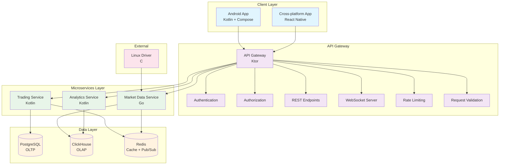

# Component Diagram

## Component Responsibilities

### Client Layer
- **Android App**: Native Android application using Kotlin and Compose
- **Cross-platform App**: React Native application for multiple platforms

### API Gateway
- **Authentication**: User identity verification
- **Authorization**: Access control and permissions
- **REST Endpoints**: Standard HTTP API endpoints
- **WebSocket Server**: Real-time communication for quotes
- **Rate Limiting**: Request throttling and protection
- **Request Validation**: Input validation and sanitization

### Microservices
- **Trading Service**: Order creation, balance checking, trade execution
- **Market Data Service**: Quote processing, normalization, distribution
- **Analytics Service**: Data aggregation, charting, statistics

### Data Stores
- **PostgreSQL**: Transactional data (users, accounts, orders, portfolios)
- **ClickHouse**: Analytical data (quotes history, trades, aggregations)
- **Redis**: Caching and real-time messaging (quotes, sessions, pub/sub)

### External Systems
- **Linux Driver**: Quote generation source written in C