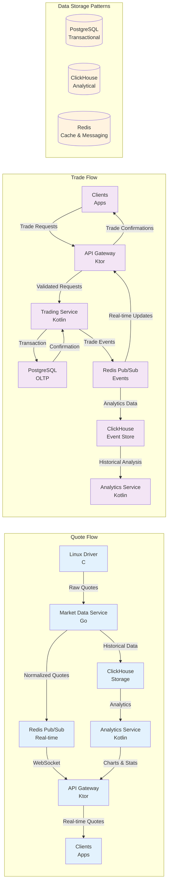

# Data Flow Diagram



## Data Flow Details

### Quote Processing Flow
1. **Generation**: Linux Driver generates raw quote data
2. **Normalization**: Market Data Service processes and normalizes quotes
3. **Distribution**: 
   - Real-time quotes via Redis Pub/Sub to WebSocket clients
   - Historical data stored in ClickHouse for analytics
4. **Analytics**: Analytics Service processes historical data for charts and statistics
5. **Delivery**: API Gateway serves both real-time and analytical data to clients

### Trade Execution Flow
1. **Request**: Clients submit trade requests through API Gateway
2. **Validation**: Trading Service validates requests and checks balances
3. **Execution**: PostgreSQL transaction records the trade
4. **Notification**: Trade events published via Redis Pub/Sub
5. **Confirmation**: Real-time updates sent to clients
6. **Analytics**: Trade data stored in ClickHouse for historical analysis

### Data Storage Strategy
- **PostgreSQL**: ACID-compliant transactional data
- **ClickHouse**: Columnar storage for time-series analytics
- **Redis**: In-memory caching and pub/sub messaging

## Key Data Flows

### Real-time Quote Streaming
```
Linux Driver → Market Data Service → Redis Pub/Sub → API Gateway WebSocket → Clients
```

### Trade Execution
```
Clients → API Gateway → Trading Service → PostgreSQL → Redis Pub/Sub → Clients
```

### Analytics Pipeline
```
Historical Data → ClickHouse → Analytics Service → API Gateway → Clients