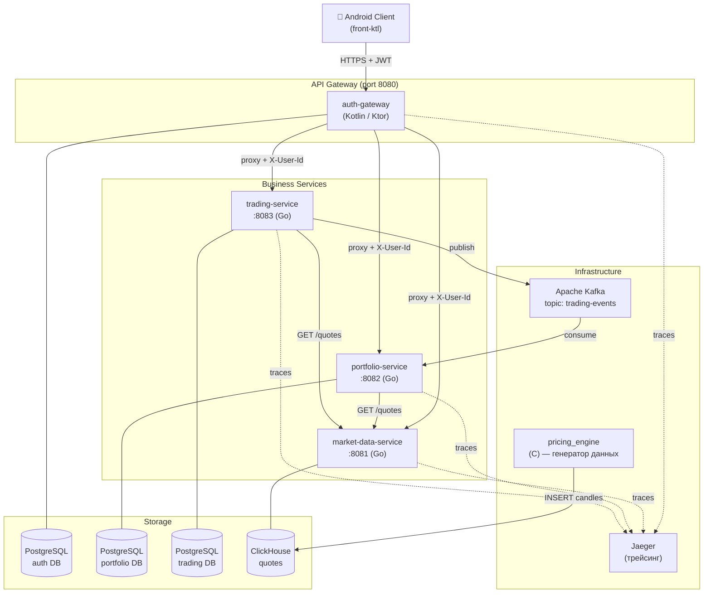

# Архитектура системы

#architecture #overview

## Общая схема

## Принципы взаимодействия

### Синхронное (HTTP/REST)
- Весь внешний трафик проходит через [[auth-gateway]] — он валидирует JWT и добавляет заголовок `X-User-Id`
- [[portfolio-service]] и [[trading-service]] обращаются к [[market-data-service]] за текущими котировками
- Прямой доступ клиента к внутренним сервисам **невозможен**

### Асинхронное (Kafka)
- [[trading-service]] публикует события в топик `trading-events` после исполнения ордера
- [[portfolio-service]] подписывается и обновляет позиции, баланс и реализованный P&L

### Трейсинг
- Все сервисы используют OpenTelemetry и отправляют трейсы в Jaeger
- Trace ID пробрасывается между сервисами через заголовок `X-Trace-Id`

## Порты и точки доступа (локально)

| Сервис / UI | URL |
|---|---|
| API Gateway | `http://localhost:8080` |
| Swagger UI | `http://localhost:8080/swagger` |
| Jaeger UI | `http://localhost:16686` |
| ClickHouse HTTP | `http://localhost:8123` |
| Kafka | `localhost:9092` |

## Паттерны проектирования

| Паттерн | Где применён |
|---|---|
| API Gateway | auth-gateway как единая точка входа |
| Event-Driven | Kafka между trading → portfolio |
| Sidecar-less Tracing | OpenTelemetry в каждом сервисе |
| Health Check | `/system/health` и `/system/ready` везде |

## Связанные страницы

- [[Создание ордера]] — главный data flow end-to-end
- [[Kafka trading-events]] — детали события
- [[auth-gateway]] — детали прокси и JWT
