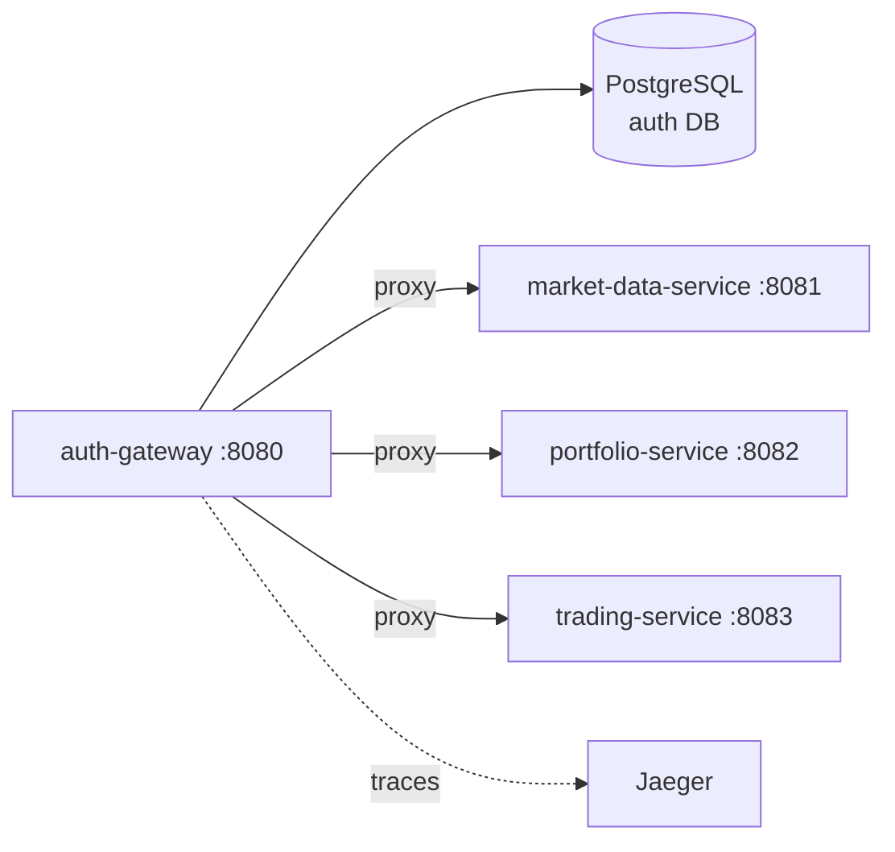

# auth-gateway

#service #kotlin #ktor #jwt

| Параметр | Значение |
|---|---|
| Язык | Kotlin (JVM 21) |
| Фреймворк | Ktor 2.3.12 |
| Порт | **8080** |
| База данных | [[PostgreSQL]] (auth DB) |
| Пул соединений | HikariCP |

## Роль в системе

Единственная точка входа для всех клиентов. Выполняет три функции:
1. **Аутентификация** — регистрация, логин, выдача и валидация JWT
2. **Авторизация** — проверяет токен на каждый запрос к бизнес-сервисам
3. **Прокси** — пробрасывает запрос downstream, добавляя `X-User-Id`

## API

Полная документация: [[Auth API]]

| Метод | Путь | Описание |
|---|---|---|
| POST | `/api/v1/auth/register` | Регистрация пользователя |
| POST | `/api/v1/auth/login` | Логин, возвращает JWT |
| POST | `/api/v1/auth/refresh` | Обновление access-токена |
| POST | `/api/v1/auth/logout` | Инвалидация токена |
| ANY | `/api/v1/market/*` | Прокси → market-data-service |
| ANY | `/api/v1/portfolio/*` | Прокси → portfolio-service |
| ANY | `/api/v1/trading/*` | Прокси → trading-service |

## Зависимости



## Как работает JWT

1. При логине генерируется пара токенов: `access_token` (короткоживущий) + `refresh_token`
2. Клиент передаёт `Authorization: Bearer <access_token>` на каждый запрос
3. Gateway извлекает `userId` из токена и добавляет заголовок `X-User-Id: <id>`
4. Downstream-сервисы **не валидируют** токен сами — доверяют заголовку

> [!warning] Безопасность
> Downstream-сервисы доступны напрямую внутри Docker-сети без аутентификации. В продакшене их следует изолировать на уровне сети.

## Переменные окружения

| Переменная | Пример | Описание |
|---|---|---|
| `DB_URL` | `jdbc:postgresql://postgres:5432/auth_gateway` | JDBC URL |
| `DB_USER` | `auth` | Пользователь БД |
| `DB_PASSWORD` | `auth_pass` | Пароль |
| `JWT_SECRET` | `supersecret` | Секрет подписи |
| `JWT_ISSUER` | `trump-invest` | Issuer токена |
| `MARKET_DATA_URL` | `http://market-data-service:8081` | Адрес market-data |
| `PORTFOLIO_URL` | `http://portfolio-service:8082` | Адрес portfolio |
| `TRADING_URL` | `http://trading-service:8083` | Адрес trading |
| `OTEL_EXPORTER_OTLP_ENDPOINT` | `http://jaeger:4317` | Jaeger endpoint |

## Сборка и запуск

```bash
# Сборка образа
docker build -t auth-gateway ./auth-gateway

# Локально (через Gradle)
cd auth-gateway && ./gradlew run
```

## Связанные страницы

- [[Архитектура]] — место в общей схеме
- [[Auth API]] — детали эндпоинтов
- [[Регистрация и логин]] — flow аутентификации
- [[PostgreSQL]] — схема auth DB
