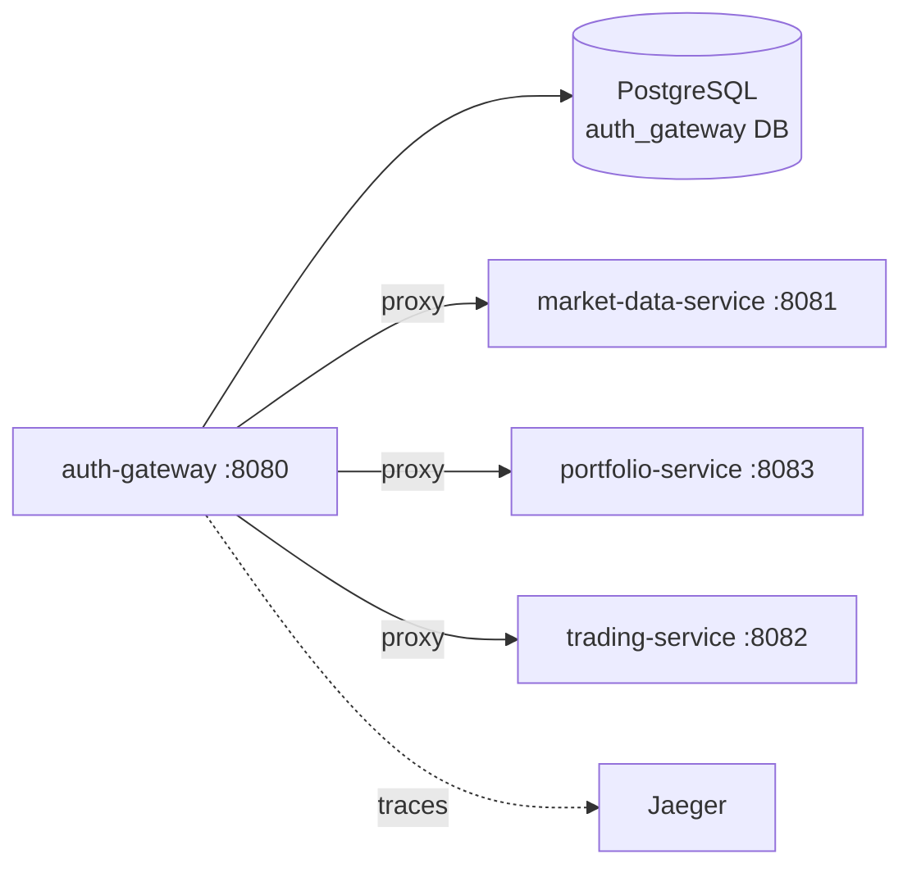

# auth-gateway

#service #kotlin #ktor #jwt

| Параметр | Значение |
|---|---|
| Язык | Kotlin (JVM 21) |
| Фреймворк | Ktor 2.3.12 |
| Порт | **8080** |
| База данных | [[PostgreSQL]] (auth_gateway DB) |
| Пул соединений | HikariCP |

## Роль в системе

Единственная точка входа для всех клиентов. Выполняет три функции:
1. **Аутентификация** — регистрация, логин, выдача и валидация JWT
2. **Авторизация** — проверяет токен на каждый запрос к бизнес-сервисам
3. **Прокси** — пробрасывает запрос downstream, добавляя `X-User-Id`

Весь код в одном файле: `src/main/kotlin/.../gateway/Application.kt` (~750 строк).

## API

Полная документация: [[Auth API]]

| Метод | Путь | Описание | Auth |
|---|---|---|---|
| POST | `/api/v1/auth/register` | Регистрация (username, email, password) | — |
| POST | `/api/v1/auth/login` | Логин → access + refresh токены | — |
| POST | `/api/v1/auth/refresh` | Ротация refresh токена | — |
| POST | `/api/v1/auth/logout` | Отзыв refresh токена | — |
| ANY | `/api/v1/market/**` | Прокси → market-data-service | — |
| ANY | `/api/v1/orders/**`, `/api/v1/trades/**` | Прокси → trading-service | Bearer JWT |
| ANY | `/api/v1/portfolio/**` | Прокси → portfolio-service | Bearer JWT |
| GET | `/api/v1/system/health` | — | — |
| GET | `/api/v1/system/ready` | — | — |

## Зависимости



## Как работает JWT

- Алгоритм: **HMAC-256**
- Access TTL: **15 минут** (`ACCESS_TOKEN_TTL_SECONDS=900`)
- Refresh TTL: **30 дней** (`REFRESH_TOKEN_TTL_SECONDS=2592000`)
- В БД хранится **SHA-256 хэш** refresh токена (не сам токен)
- Downstream-сервисы **не валидируют** токен сами — доверяют заголовку `X-User-Id`

> [!warning] Безопасность
> Downstream-сервисы доступны напрямую внутри Docker-сети без аутентификации. В продакшене их следует изолировать на уровне сети.

## БД (PostgreSQL, auto-create при старте)

```sql
users (id, username, email, password_hash, balance, created_at, updated_at)
auth_refresh_tokens (id, user_id, token_hash, expires_at, revoked_at, created_at)
```

Миграций нет — `CREATE TABLE IF NOT EXISTS` при старте с retry (30 попыток).

## BCrypt и производительность

| `BCRYPT_COST` | Время хэширования | Когда использовать |
|---|---|---|
| 6 | ~20 мс | Нагрузочные тесты (`docker-compose.yml`) |
| 10 | ~300 мс | Продакшен |

> [!important]
> `BCRYPT_COST=6` в `docker-compose.yml` задан намеренно. При cost=10 login/register занимают ~300ms и быстро насыщают thread pool под нагрузкой (9%+ ошибок аутентификации).

## Переменные окружения

| Переменная | Дефолт | Заметка |
|---|---|---|
| `PORT` | 8080 | |
| `DATABASE_URL` | `jdbc:postgresql://localhost:5432/auth_gateway` | |
| `DATABASE_POOL_SIZE` | 10 | В compose: **50** |
| `JWT_SECRET` | `change-me-in-production` | **Менять в проде!** |
| `ACCESS_TOKEN_TTL_SECONDS` | 900 | 15 минут |
| `REFRESH_TOKEN_TTL_SECONDS` | 2592000 | 30 дней |
| `BCRYPT_COST` | 10 | В compose: **6** |
| `MARKET_SERVICE_URL` | `http://localhost:8081/api/v1` | |
| `ORDER_SERVICE_URL` | `http://localhost:8082/api/v1` | |
| `PORTFOLIO_SERVICE_URL` | `http://localhost:8083/api/v1` | |
| `HTTP_CLIENT_MAX_CONNECTIONS` | 4000 | CIO клиент |
| `NETTY_WORKER_THREADS` | CPUs×4, min 16 | |
| `OTEL_EXPORTER_ENDPOINT` | — | jaeger:4317 |

## Сборка и запуск

```bash
# Сборка образа
docker build -t auth-gateway ./auth-gateway

# Локально (через Gradle)
cd auth-gateway && ./gradlew run
```

## Связанные страницы

- [[Архитектура]] — место в общей схеме
- [[Auth API]] — детали эндпоинтов
- [[Регистрация и логин]] — flow аутентификации
- [[PostgreSQL]] — схема auth DB
