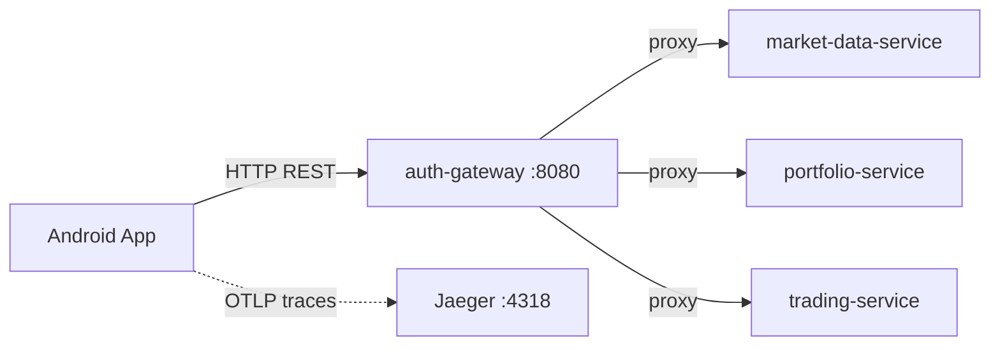

# front-ktl (Android-клиент)

#service #android #kotlin #compose

| Параметр | Значение |
|---|---|
| Язык | Kotlin 2.2 |
| UI | Jetpack Compose + Material3 |
| Паттерн | MVVM + Repository |
| minSdk | 24 |
| compileSdk | 36 |
| DI | Ручной (синглтоны через `TrumpApp`) |

## Роль в системе

Нативное Android-приложение. Единственный клиент, видимый конечному пользователю. Все запросы идут через [[auth-gateway]] (порт 8080).



## Архитектура (слои)

```
UI Layer          — Composable-экраны + NavigationSuiteScaffold
ViewModel Layer   — StateFlow, AndroidViewModel
Repository Layer  — suspend fun / Flow, бизнес-логика
Network Layer     — Retrofit 2.11 + OkHttp 4.12 + kotlinx.serialization
```

## Структура пакетов

```
org.awesoma.trumpinvestitions/
├── TrumpApp.kt                    # Application: сеть, токены, OTel
├── MainActivity.kt                # Compose entry point, роутинг auth/main
├── navigation/Screen.kt           # sealed class маршрутов
├── ui/
│   ├── screens/
│   │   ├── auth/                  # LoginScreen, RegisterScreen
│   │   ├── market/                # StocksScreen, StockDetailScreen
│   │   ├── portfolio/             # PortfolioScreen
│   │   └── profile/               # ProfileScreen
│   ├── viewmodel/                 # AuthVM, StocksVM, StockDetailVM, PortfolioVM
│   └── theme/
└── data/
    ├── network/                   # AppNetwork, ApiService, AuthApiService
    ├── repository/                # AuthRepo, MarketRepo, PortfolioRepo
    ├── auth/                      # TokenManager, AuthInterceptor, TokenRefreshAuthenticator
    ├── model/                     # DTO и доменные модели
    └── settings/                  # SettingsManager (хост сервера)
```

## Сеть (AppNetwork)

Два Retrofit-клиента на одном OkHttp:

| Клиент | Interceptors | Для чего |
|---|---|---|
| `authApiService` | Logging, OTel | `/auth/login`, `/auth/register`, `/auth/refresh` |
| `apiService` | Logging, OTel, AuthInterceptor, TokenRefreshAuthenticator | Все остальные запросы |

**AuthInterceptor** — добавляет `Authorization: Bearer <access_token>` к каждому запросу.

**TokenRefreshAuthenticator** — перехватывает 401, вызывает `/auth/refresh`, сохраняет новые токены и повторяет запрос. При ошибке — очищает токены, редирект на логин.

## Навигация

```
Старт
 ├─ токен есть? ─Да─► MainApp (BottomNav)
 │                       ├── Market (StocksScreen)
 │                       ├── Portfolio (PortfolioScreen)
 │                       └── Profile (ProfileScreen)
 └─ Нет ─► AuthFlow
               ├── LoginScreen
               └── RegisterScreen
```

`NavigationSuiteScaffold` адаптирует нижнюю/боковую навигацию под размер экрана.

## Экраны и ViewModels

| ViewModel | Что делает |
|---|---|
| `AuthViewModel` | Login, register, logout |
| `StocksViewModel` | Список инструментов, котировки, поиск. Polling **5 сек** |
| `StockDetailViewModel` | Свечи (1H/4H/1D/1W/1M → `1m/5m/15m/1h/1d`), стакан, размещение ордера |
| `PortfolioViewModel` | Баланс, позиции, история ордеров, депозит/вывод. Polling **10 сек** |

## Polling (без WebSocket)

```kotlin
fun getStocksFlow(): Flow<List<Stock>> = flow {
    while (true) {
        emit(mapToStocks(apiService.getQuotes(SYMBOLS)))
        delay(5_000)
    }
}
```

## Подключение к бэкенду

```kotlin
// SettingsManager.kt
var serverHost: String = "10.0.2.2:8080"   // дефолт для Android-эмулятора
val baseUrl: String = "http://$serverHost/api/v1/"
```

| Окружение | Хост |
|---|---|
| Android-эмулятор | `10.0.2.2:8080` |
| Реальное устройство | `192.168.x.x:8080` |
| Linux VM (bridge) | IP виртуалки`:8080` |

Хост меняется в настройках приложения → сохраняется в SharedPreferences → `TrumpApp.rebuildNetwork()` пересоздаёт клиент без перезапуска.

## Хранение данных

| Данные | Хранилище |
|---|---|
| Access token | DataStore Preferences |
| Refresh token | DataStore Preferences |
| Username | DataStore Preferences |
| Хост сервера | SharedPreferences |
| OTel endpoint | SharedPreferences |
| Рыночные данные | Только в памяти (нет Room) |

## Наблюдаемость

`TrumpApp` инициализирует OTel SDK с OTLP HTTP exporter на Jaeger порт **4318**. Все OkHttp-запросы инструментируются автоматически — сквозная трассировка от мобильного клиента до бэкенда.

## Сборка

```bash
./gradlew assembleDebug
# или через Android Studio → Run
```

Требования: Android Studio Iguana+, JDK 11+, Android SDK 36.

## Связанные страницы

- [[auth-gateway]] — единственная точка входа
- [[Market Data API]] — котировки, свечи, стакан
- [[Portfolio API]] — баланс, позиции, P&L
- [[Trading API]] — ордера, сделки
- [[Архитектура]] — место в системе
