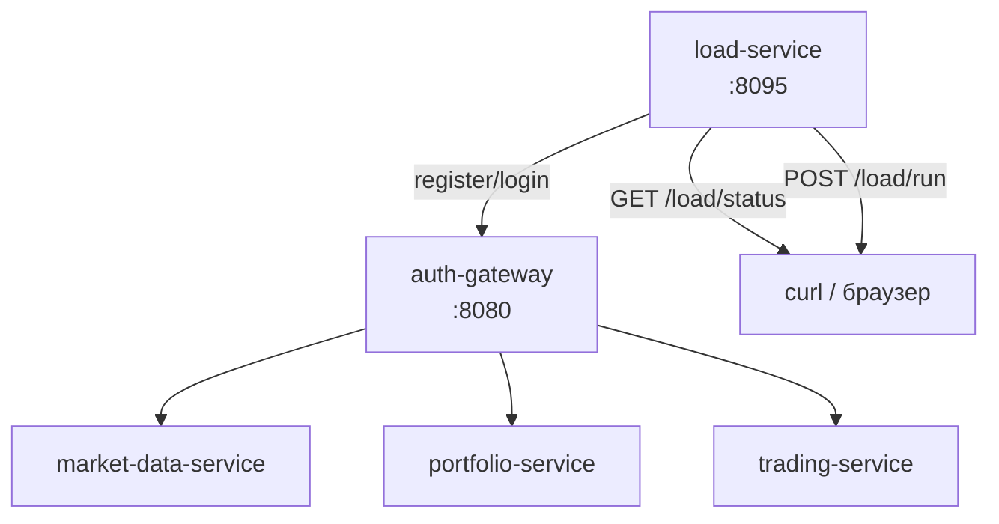

# load-service

#service #kotlin #ktor #load-testing

| Параметр | Значение |
|---|---|
| Язык | Kotlin / Ktor 2.3 |
| Порт | **8095** |
| Docker profile | `load` (не стартует при обычном `docker compose up`) |
| Зависит от | [[auth-gateway]], [[market-data-service]], [[portfolio-service]], [[trading-service]] |

## Роль в системе

Сервис нагрузочного тестирования. Симулирует N виртуальных пользователей, каждый из которых проходит полный жизненный цикл: регистрация → логин → пополнение баланса → рыночные запросы → выставление ордеров.

Все запросы идут через [[auth-gateway]] — нагрузка реалистична и покрывает весь путь через систему.

## Как работает



### Сценарий виртуального пользователя

Каждый пользователь запускается как корутина (`async/await`), стартует с задержкой `rampUpSeconds / virtualUsers` и выполняет цикл:

1. Регистрация (`POST /auth/register`)
2. Логин → JWT-токен (`POST /auth/login`)
3. Пополнение баланса на `INITIAL_DEPOSIT`
4. Бесконечный цикл до дедлайна:
   - 45% — запросы к рыночным данным (котировки, стакан, свечи)
   - 25% — запросы к портфелю (позиции, PnL, баланс)
   - 20% — история ордеров и сделок
   - 10% — health/ready эндпоинты
   - каждые `ORDER_EVERY_N_ITERATIONS` итераций — выставить ордер и прочитать его детали

### Параллелизм

Все виртуальные пользователи — Kotlin корутины на `Dispatchers.Default`. HTTP-клиент (Ktor CIO) настроен на пул соединений `max(1000, virtualUsers * 2)`. Метрики защищены `AtomicLong` и `ConcurrentHashMap`.

## API

| Метод | Путь | Описание |
|---|---|---|
| GET | `/api/v1/system/health` | Health check |
| GET | `/api/v1/system/ready` | Readiness probe |
| GET | `/api/v1/load/status` | Текущие метрики теста |
| POST | `/api/v1/load/run` | Запустить тест (409 если уже запущен) |

### Пример ответа `/load/status`

```json
{
  "running": true,
  "activeUsers": 847,
  "configuredUsers": 1000,
  "totalRequests": 142300,
  "successfulRequests": 141900,
  "failedRequests": 400,
  "ordersSubmitted": 4210,
  "summary": {
    "requestsPerSecond": "284.50",
    "latency": {
      "minMs": 2,
      "avgMs": 18,
      "p50Ms": 12,
      "p95Ms": 54,
      "p99Ms": 112,
      "maxMs": 890
    }
  }
}
```

## Дашборд реального времени

Веб-интерфейс на `http://localhost:8096` — опрашивает load-service каждые 2 секунды.

```bash
docker compose --profile load up -d load-dashboard
make load-dashboard   # открыть в браузере
```

Показывает:

- статус теста, активные пользователи, error rate, RPS, p95/p99
- графики по времени: RPS, ошибки %, пользователи, latency (p50/p95/p99)
- таблицу эндпоинтов с разбивкой успех/ошибки

HTML-файл: `load-service/dashboard/index.html` (nginx, docker profile `load`).

## Запуск

```bash
# Стандартный запуск (1000 пользователей, 120 сек)
make load-test

# Кастомные параметры
make load-test LOAD_USERS=500 LOAD_DURATION_SECONDS=60 LOAD_RAMP_UP_SECONDS=15

# 10 000 пользователей
make load-test-10000

# Статус во время теста
make load-status
```

## Переменные окружения

| Переменная | Умолчание | Описание |
|---|---|---|
| `VIRTUAL_USERS` | `1000` | Количество виртуальных пользователей |
| `DURATION_SECONDS` | `120` | Длительность теста |
| `RAMP_UP_SECONDS` | `30` | Плавный старт пользователей |
| `ORDER_EVERY_N_ITERATIONS` | `6` | Как часто пользователь создаёт ордер |
| `THINK_TIME_MS` | `10000` | Пауза между итерациями |
| `INITIAL_DEPOSIT` | `1000000.00` | Начальный депозит каждого пользователя |
| `SELL_ORDER_PERCENT` | `0` | % SELL-ордеров среди всех |
| `SYMBOLS` | `AAPL,MSFT,TSLA,BTCUSDT,ETHUSDT` | Инструменты |
| `RUN_ON_START` | `true` | Автозапуск теста при старте контейнера |
| `START_DELAY_SECONDS` | `10` | Задержка перед автозапуском |

## Связанные страницы

- [[Локальный запуск]] — как поднять инфраструктуру перед тестом
- [[auth-gateway]] — точка входа для всех запросов
- [[Архитектура]] — место в системе
