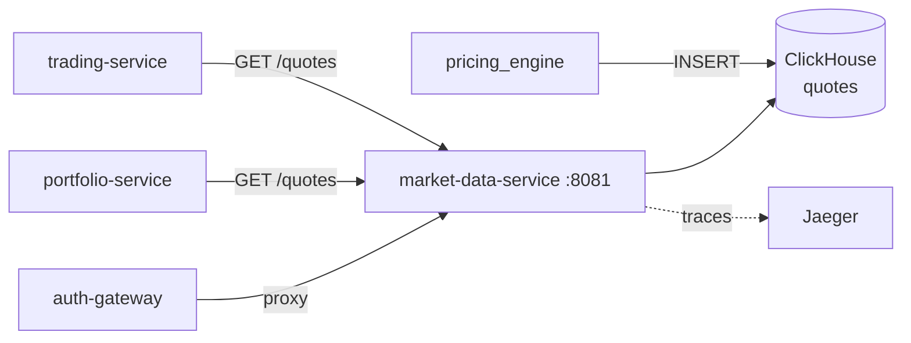

# market-data-service

#service #go #clickhouse

| Параметр | Значение |
|---|---|
| Язык | Go 1.25 |
| HTTP Router | stdlib `net/http` |
| Порт | **8081** |
| База данных | [[ClickHouse]] (default DB) |

## Роль в системе

Read-only сервис рыночных данных. Хранит и отдаёт:
- Текущие котировки (bid/ask/last)
- Исторические свечи OHLCV
- Стакан заявок (order book)
- Поиск инструментов по символу

Данные в ClickHouse загружает [[pricing_engine]].

## API

Полная документация: [[Market Data API]]

| Метод | Путь | Описание |
|---|---|---|
| GET | `/api/v1/system/health` | Health check |
| GET | `/api/v1/system/ready` | Readiness probe |
| GET | `/api/v1/instruments` | Поиск `?q=AAPL&limit=10&offset=0` |
| GET | `/api/v1/instruments/{symbol}` | Инструмент по символу |
| GET | `/api/v1/quotes` | Котировки `?symbols=AAPL,MSFT` |
| GET | `/api/v1/quotes/{symbol}` | Котировка одного символа |
| GET | `/api/v1/history/candles` | Свечи `?symbol=AAPL&from=…&to=…&resolution=1H` |
| GET | `/api/v1/order-book/{symbol}` | Стакан `?depth=10` |

## Зависимости

## Структура данных ClickHouse

Таблица `quotes` (MergeTree, сортировка по `symbol, event_time_ns`):

| Колонка | Тип | Описание |
|---|---|---|
| `symbol` | String | Тикер инструмента |
| `event_time_ns` | UInt64 | Timestamp в наносекундах |
| `sequence` | UInt64 | Порядковый номер |
| `bid_price` | Decimal | Цена покупки |
| `bid_size` | Decimal | Объём покупки |
| `ask_price` | Decimal | Цена продажи |
| `ask_size` | Decimal | Объём продажи |
| `last_price` | Decimal | Цена последней сделки |
| `last_size` | Decimal | Объём последней сделки |
| `mid_price` | Decimal | Средняя цена |
| `spread` | Decimal | Спред bid/ask |
| `scenario_id` | String | ID сценария из pricing_engine |
| `venue` | String | Торговая площадка |

## Резолюции свечей

Поддерживаемые значения параметра `resolution`:
`1m`, `5m`, `15m`, `30m`, `1H`, `4H`, `1D`, `1W`

## Переменные окружения

| Переменная | Пример | Описание |
|---|---|---|
| `CLICKHOUSE_HOST` | `clickhouse` | Хост ClickHouse |
| `CLICKHOUSE_PORT` | `9000` | TCP порт |
| `CLICKHOUSE_DB` | `default` | База данных |
| `CLICKHOUSE_USER` | `market_data` | Пользователь |
| `CLICKHOUSE_PASSWORD` | `market_pass` | Пароль |
| `HTTP_PORT` | `8081` | Порт сервиса |
| `OTEL_EXPORTER_OTLP_ENDPOINT` | `http://jaeger:4317` | Jaeger |

## Связанные страницы

- [[Market Data API]] — полные эндпоинты
- [[ClickHouse]] — детали БД и схема
- [[pricing_engine]] — откуда берутся данные
- [[Архитектура]] — место в системе
