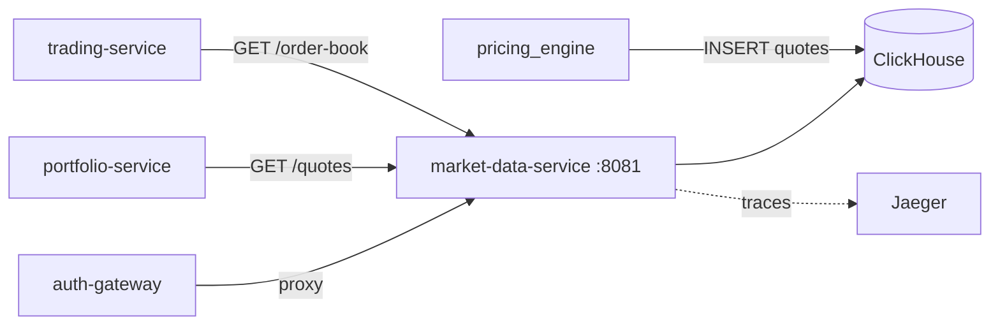

# market-data-service

#service #go #clickhouse

| Параметр | Значение |
|---|---|
| Язык | Go 1.25 |
| HTTP Router | stdlib `net/http` |
| Порт | **8081** |
| База данных | [[ClickHouse]] (HTTP API) |
| Паттерн | Handler → Service → Repository |

## Роль в системе

Read-only сервис рыночных данных. Хранит и отдаёт:
- Текущие котировки (bid/ask/last)
- Исторические свечи OHLCV (1m/5m/15m/1h/1d)
- Стакан заявок (order book, синтетический)
- Поиск инструментов по символу

Данные в ClickHouse загружает [[pricing_engine]]. Нет прямого доступа извне — только через [[auth-gateway]].

## API

Полная документация: [[Market Data API]]

| Метод | Путь | Параметры |
|---|---|---|
| GET | `/api/v1/system/health` | — |
| GET | `/api/v1/system/ready` | — |
| GET | `/api/v1/instruments` | `q`, `limit` (1-200, def 50), `offset` |
| GET | `/api/v1/instruments/{symbol}` | — |
| GET | `/api/v1/quotes` | `symbols` (через запятую) |
| GET | `/api/v1/quotes/{symbol}` | — |
| GET | `/api/v1/history/candles` | `symbol`, `from`, `to` (RFC3339), `interval`, `limit` (1-10000) |
| GET | `/api/v1/order-book/{symbol}` | `depth` (1-100, def 20) |

Интервалы свечей: `1m`, `5m`, `15m`, `1h`, `1d`.

## Зависимости



## Кэш (in-memory, sync.RWMutex)

**Stale-while-revalidate:** при недоступности ClickHouse возвращает последние кэшированные данные вместо 500.  
**Jitter ±30%:** стагирует истечение кэша по символам, предотвращает cache stampede.

| Данные | TTL | Ключ | При ошибке ClickHouse |
|---|---|---|---|
| Котировки | **200 мс** | `sym1,sym2,...` (sorted) | stale данные |
| Стакан | **5 с** ±30% | `symbol` | stale данные |
| Свечи | **30 с** ±30% | `sym:from:rounded_to:interval:limit` | stale данные |
| Список символов | **30 с** | глобальный (только offset=0, q="") | stale данные |

> [!note] Candle cache key
> `to` округляется до 30-секундного бакета (`to.Truncate(30s)`), иначе `time.Now()` делал каждый ключ уникальным → кэш никогда не попадал.

## ClickHouse-таблицы

| Таблица            | Engine                            | Для чего                                    |
| ------------------ | --------------------------------- | ------------------------------------------- |
| `quotes`           | MergeTree, TTL 24h                | raw тики от pricing_engine                  |
| `quotes_latest`    | ReplacingMergeTree(event_time_ns) | последняя котировка на символ (O(1) lookup) |
| `quotes_latest_mv` | MaterializedView                  | auto-fill quotes_latest                     |
| `candles_1m`       | **AggregatingMergeTree**          | pre-aggregated 1m OHLCV                     |
| `candles_1m_mv`    | MaterializedView                  | auto-fill candles_1m                        |

> [!warning]
> `candles_1m` **обязана** быть `AggregatingMergeTree` — колонки типа `AggregateFunction(argMin, ...)`.  
> `ReplacingMergeTree` вызовет ошибку типов при вставке через MV.

## ClickHouse-запросы

**Котировки** — point-lookup из MV (не full scan!):
```sql
SELECT symbol, bid_price, ask_price, last_price, event_time_ns
FROM quotes_latest FINAL WHERE symbol IN (...)
```

**Свечи** — из pre-aggregated таблицы (не raw quotes!):
```sql
SELECT intDiv(bucket_ns, N)*N AS bucket_ns,
       argMinMerge(open), maxMerge(high), minMerge(low),
       argMaxMerge(close), toInt64(round(sumMerge(volume)))
FROM candles_1m WHERE symbol=? AND bucket_ns BETWEEN ? AND ?
GROUP BY bucket_ns ORDER BY bucket_ns LIMIT ?
```

**Стакан** — point-lookup + синтетические уровни:
```sql
SELECT bid_price, bid_size FROM quotes_latest FINAL WHERE symbol = ?
```
Depth-уровни синтезируются в Go: цена ±0.1% × уровень, объём / уровень.

## Переменные окружения

| Переменная | Дефолт | |
|---|---|---|
| `HTTP_PORT` | 8080 | В compose: 8081 |
| `HTTP_BASE_PATH` | `/api/v1` | |
| `CLICKHOUSE_URL` | `http://localhost:8123` | |
| `CLICKHOUSE_DATABASE` | `default` | |
| `CLICKHOUSE_USER` | — | |
| `CLICKHOUSE_PASSWORD` | — | |
| `CLICKHOUSE_QUERY_TIMEOUT` | `5s` | |
| `OTEL_EXPORTER_ENDPOINT` | — | jaeger:4317 |

## Сборка

Multi-stage Dockerfile: `golang:1.25-alpine` → `alpine:3.22`. Статический бинарь (`CGO_ENABLED=0`). Образ ~20-30 МБ.

## Связанные страницы

- [[Market Data API]] — полные эндпоинты
- [[ClickHouse]] — детали БД и схема
- [[pricing_engine]] — откуда берутся данные
- [[Архитектура]] — место в системе
