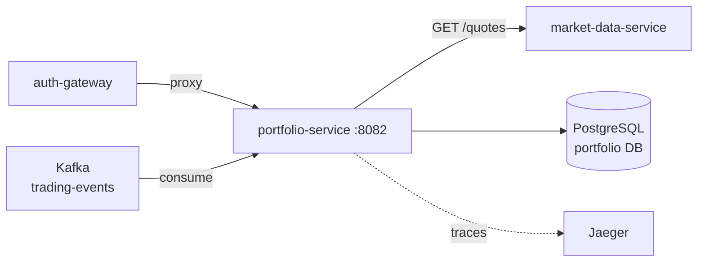

# portfolio-service

#service #go #kafka #postgresql

| Параметр | Значение |
|---|---|
| Язык | Go 1.25 |
| HTTP Router | Gorilla Mux |
| Порт | **8082** |
| База данных | [[PostgreSQL]] (portfolio DB) |
| Messaging | [[Kafka]] consumer (trading-events) |

## Роль в системе

Управляет финансовым состоянием пользователя:
- Хранит денежный баланс
- Отслеживает позиции по инструментам (количество, средняя цена)
- Считает P&L (реализованный и нереализованный)
- Обрабатывает события исполнения ордеров из Kafka

## API

Полная документация: [[Portfolio API]]

| Метод | Путь | Описание |
|---|---|---|
| GET | `/api/v1/portfolio` | Снапшот: баланс + все позиции |
| GET | `/api/v1/positions` | Список позиций (`?symbol=AAPL`) |
| GET | `/api/v1/positions/{symbol}` | Позиция по символу |
| GET | `/api/v1/pnl` | Реализованный + нереализованный P&L |
| GET | `/api/v1/balance/cash` | Денежный баланс |
| POST | `/api/v1/balance/deposit` | Пополнение счёта |
| POST | `/api/v1/balance/withdraw` | Вывод средств |
| GET | `/api/v1/orders` | История ордеров |
| GET | `/api/v1/trades` | История сделок |
| GET | `/api/v1/assets/{symbol}/quantity` | Количество актива |
| GET | `/api/v1/system/health` | Health check |
| GET | `/api/v1/system/ready` | Readiness |

## Зависимости



## Схема базы данных

```sql
-- Кассовый баланс пользователя
portfolios (
  user_id     UUID PRIMARY KEY,
  cash_balance DECIMAL(20,8) NOT NULL DEFAULT 0,
  updated_at  TIMESTAMPTZ
)

-- Открытые позиции
positions (
  id           UUID PRIMARY KEY,
  user_id      UUID NOT NULL,
  symbol       VARCHAR(20) NOT NULL,
  quantity     DECIMAL(20,8) NOT NULL DEFAULT 0,
  avg_price    DECIMAL(20,8) NOT NULL DEFAULT 0,
  realized_pnl DECIMAL(20,8) NOT NULL DEFAULT 0,
  updated_at   TIMESTAMPTZ,
  UNIQUE (user_id, symbol)
)

-- Индексы
INDEX ON positions(user_id)
INDEX ON positions(user_id, symbol)
```

## Kafka-консьюмер

Топик: `trading-events`

При получении события `ORDER_FILLED`:
1. Уменьшает/увеличивает `cash_balance` в `portfolios`
2. Обновляет `quantity` и пересчитывает `avg_price` в `positions`
3. Если сделка на продажу — фиксирует реализованный P&L

## P&L расчёт

**Нереализованный P&L** = `(current_price - avg_price) × quantity`
- Текущая цена запрашивается у [[market-data-service]] в момент вызова API

**Реализованный P&L** = `Σ (sell_price - avg_price) × sell_quantity`
- Накапливается в поле `realized_pnl` таблицы `positions`

## Переменные окружения

| Переменная | Пример | Описание |
|---|---|---|
| `DB_HOST` | `postgres` | Хост PostgreSQL |
| `DB_PORT` | `5432` | Порт |
| `DB_NAME` | `portfolio` | База данных |
| `DB_USER` | `trading` | Пользователь |
| `DB_PASSWORD` | `trading_pass` | Пароль |
| `KAFKA_BROKERS` | `kafka:9092` | Брокеры Kafka |
| `KAFKA_GROUP_ID` | `portfolio-service` | Consumer group |
| `MARKET_DATA_URL` | `http://market-data-service:8081/api/v1` | URL market-data |
| `HTTP_PORT` | `8082` | Порт сервиса |
| `OTEL_EXPORTER_OTLP_ENDPOINT` | `http://jaeger:4317` | Jaeger |

## Связанные страницы

- [[Portfolio API]] — полные эндпоинты
- [[Kafka trading-events]] — формат событий
- [[PostgreSQL]] — схема БД
- [[Создание ордера]] — как portfolio обновляется после сделки
