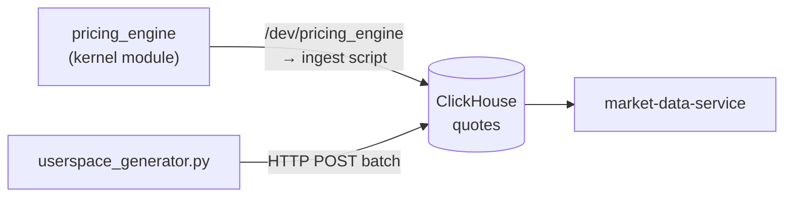

# pricing_engine

| Параметр | Значение |
| --- | --- |
| Язык | C (kernel module) + Python (userspace fallback) |
| Тип | Linux kernel module (character device driver) |
| Устройство | `/dev/pricing_engine` |
| Вывод | NDJSON → [[ClickHouse]] |

## Роль в системе

Генерирует синтетические рыночные котировки для 5 символов и загружает их в ClickHouse. Используется для:

- Наполнения стенда демо-данными (статический режим)
- Непрерывного live-потока котировок в реальном времени (kernel module)

Не принимает HTTP-запросы. Не является Docker-контейнером.

## Два режима работы

### Режим 1 — статические данные (YAML-сценарии)

Разовая загрузка предопределённых котировок из YAML-файлов. Запускается при `make setup`.

```bash
make load-data   # загрузить все 5 сценариев (5×1000 строк)
make reset-data  # сбросить и перезагрузить
```

### Режим 2 — живой поток (kernel module)

Непрерывная генерация котировок через `/dev/pricing_engine`. Каждый `read()` возвращает новые котировки для следующего символа по round-robin.

```bash
# Собрать .ko, загрузить модуль, запустить батч-цикл (блокирующий)
make live-data

# Остановить поток: Ctrl+C
# Выгрузить модуль:
sudo rmmod pricing_engine
```

## Поддерживаемые инструменты

Все 5 символов генерируются одним экземпляром модуля по round-robin:

| Символ | Начальная цена |
| --- | --- |
| `BTCUSDT` | $65 000 |
| `AAPL` | $175 |
| `ETHUSDT` | $3 500 |
| `MSFT` | $400 |
| `TSLA` | $170 |

## Что генерируется

Для каждого символа генерируются котировки (bid/ask/last) по модели случайного блуждания. Цена каждого символа эволюционирует независимо.

Структура генерируемой записи:

```json
{
  "schema_version": 1,
  "sequence":       42,
  "event_type":     "quote",
  "quote_type":     "update",
  "event_time_ns":  1700000000000000000,
  "engine_time_ns": 1700000000000000000,
  "scenario_id":    "kernel_random_walk",
  "venue":          "KERNEL_SIM",
  "symbol":         "BTCUSDT",
  "bid_price":      64999.75,
  "bid_size":       100.00,
  "ask_price":      65000.25,
  "ask_size":       100.00,
  "mid_price":      65000.00,
  "spread":         0.50,
  "last_price":     65000.10,
  "last_size":      50.00,
  "last_trade_side": "buy"
}
```

## Параметры модуля

При загрузке через `insmod` можно переопределить:

| Параметр | Дефолт | Описание |
| --- | --- | --- |
| `spread_cents` | 50 | Спред bid/ask в центах ($0.50) |
| `max_move_cents` | 25 | Макс. случайное движение цены за тик |
| `default_size_units` | 100 | Базовый размер котировки |
| `max_last_move_cents` | 10 | Макс. отклонение last от mid |

```bash
sudo insmod pricing_engine.ko spread_cents=100 max_move_cents=50
```

## Механизм backfill (исторические данные)

При загрузке модуля предварительно генерируются исторические записи:

| Параметр | Дефолт | |
|---|---|---|
| `history_hours` | 24 | Глубина истории |
| `history_qph` | 20 | Котировок на символ в час |
| `PE_MAX_HISTORY` | 8760 | Макс записей (365×24) |

Итого при дефолтах: `24 × 20 × 5 = 2400 строк` с историческими timestamp.  
При чтении сначала отдаются исторические записи, затем live-генерация. После исчерпания буфер освобождается.

## Python userspace (`userspace_generator.py`)

Drop-in замена без ядра — пишет напрямую в ClickHouse HTTP API батчами. Используется на Windows/macOS или когда нет возможности собрать модуль.

```bash
python3 pricing_engine/userspace_generator.py
```

| Переменная | Дефолт | |
|---|---|---|
| `CLICKHOUSE_URL` | `http://localhost:8123` | |
| `CLICKHOUSE_USER` | — | |
| `CLICKHOUSE_PASSWORD` | — | |
| `TABLE` | `quotes` | |
| `BATCH_SIZE` | 100 | Строк в одной вставке |
| `SLEEP_SECONDS` | 0.1 | Пауза между батчами |
| `HISTORY_HOURS` | 24 | |
| `HISTORY_QUOTES_PER_HOUR` | 20 | |

Scenario ID: `"userspace_random_walk"`, Venue: `"USERSPACE_SIM"`.

## Связь с другими компонентами



> [!warning] Важно: схема ClickHouse
> Таблица `candles_1m` **обязана** быть `AggregatingMergeTree`.  
> Если была создана как `ReplacingMergeTree` — пересоздать:
> ```sql
> DROP TABLE IF EXISTS candles_1m_mv;
> DROP TABLE IF EXISTS candles_1m;
> -- затем выполнить db/clickhouse/init.sql
> ```

## Связанные страницы

- [[ClickHouse]] — куда пишутся данные
- [[market-data-service]] — кто эти данные читает
- [[Тестирование]] — как используется в интеграционных тестах
