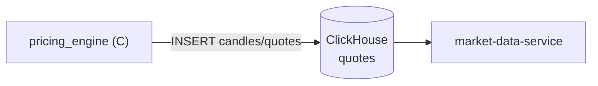

# pricing_engine

#service #c #data-generator

| Параметр | Значение |
|---|---|
| Язык | C |
| Тип | Генератор данных (не HTTP-сервис) |
| Вывод | JSON → [[ClickHouse]] |

## Роль в системе

Генерирует синтетические рыночные данные и загружает их в ClickHouse. Используется для:
- Наполнения стенда демо-данными
- Интеграционных тестов (воспроизводимые сценарии)

Не принимает HTTP-запросы. Запускается как разовый процесс или по расписанию.

## Поддерживаемые инструменты

Предзагружено 5 сценариев:

| Символ | Описание |
|---|---|
| `AAPL` | Apple Inc. |
| `MSFT` | Microsoft Corp. |
| `TSLA` | Tesla Inc. |
| `BTC/USDT` | Bitcoin |
| `ETH/USDT` | Ethereum |

## Что генерируется

Для каждого инструмента генерируются свечи OHLCV + котировки (bid/ask/last) и записываются в таблицу `quotes` ClickHouse.

Структура генерируемой записи:

```json
{
  "symbol":         "AAPL",
  "event_time_ns":  1700000000000000000,
  "sequence":       1,
  "bid_price":      "150.25",
  "bid_size":       "100",
  "ask_price":      "150.30",
  "ask_size":       "150",
  "last_price":     "150.27",
  "last_size":      "50",
  "mid_price":      "150.275",
  "spread":         "0.05",
  "scenario_id":    "scenario_aapl_1",
  "venue":          "NASDAQ",
  "event_type":     "QUOTE",
  "quote_type":     "NBBO"
}
```

## Связь с другими компонентами



## Запуск

```bash
# Сборка
cd pricing_engine && make build

# Запуск через Docker Compose (автоматически при make setup)
docker compose up pricing_engine
```

> [!info] Только для тестов
> В продуктовой среде pricing_engine заменяется на реальный маркет-дата фид. Сервис предназначен исключительно для разработки и тестирования.

## Связанные страницы

- [[ClickHouse]] — куда пишутся данные
- [[market-data-service]] — кто эти данные читает
- [[Тестирование]] — как используется в интеграционных тестах
