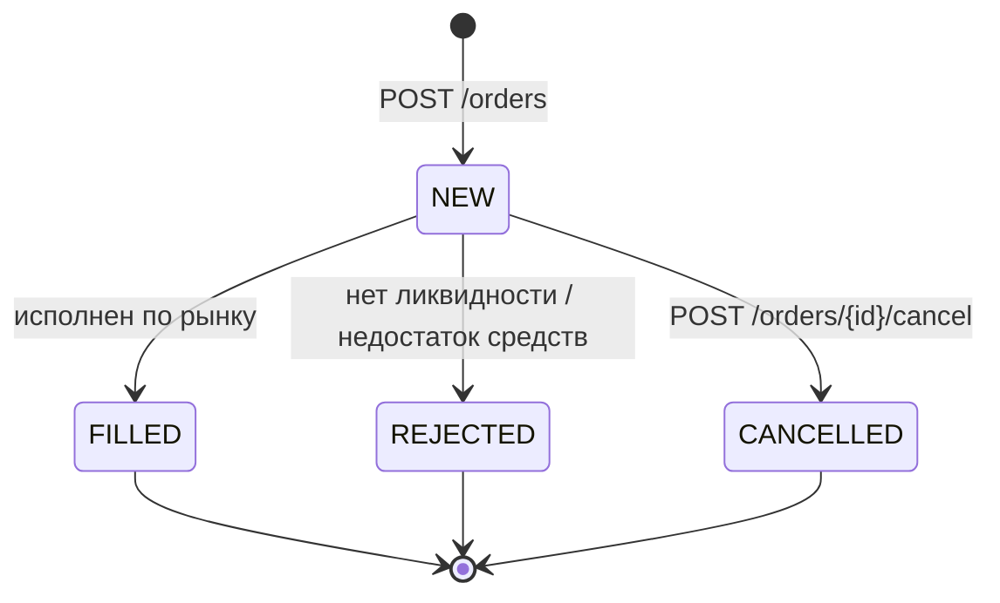
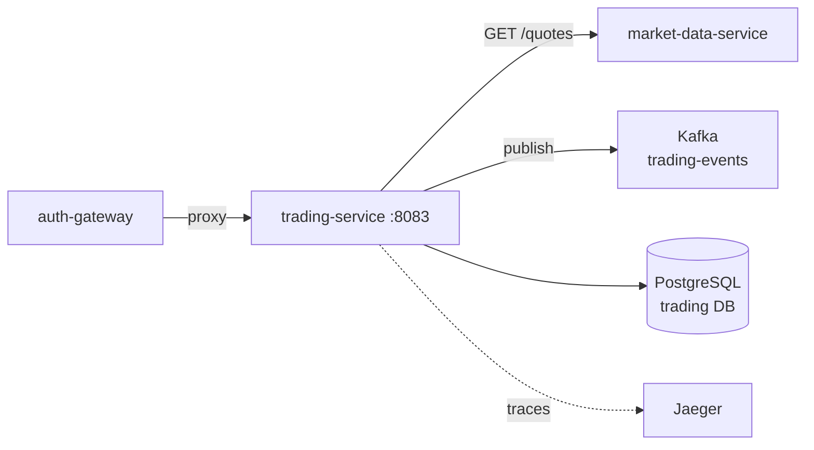

# trading-service

#service #go #kafka #postgresql

| Параметр | Значение |
|---|---|
| Язык | Go 1.25 |
| HTTP Router | Chi |
| Порт | **8083** |
| База данных | [[PostgreSQL]] (trading DB) |
| Messaging | [[Kafka]] producer (trading-events) |

## Роль в системе

Сервис исполнения торговых ордеров:
- Принимает рыночные ордера на покупку/продажу
- Немедленно пытается исполнить ордер по текущей котировке
- Записывает сделки и публикует события в Kafka
- Хранит историю ордеров и сделок

## Жизненный цикл ордера



## API

Полная документация: [[Trading API]]

| Метод | Путь | Описание |
|---|---|---|
| GET | `/api/v1/system/health` | Health check |
| GET | `/api/v1/system/ready` | Readiness |
| POST | `/api/v1/orders` | Создать ордер |
| GET | `/api/v1/orders` | Список ордеров пользователя |
| GET | `/api/v1/orders/{orderId}` | Детали ордера |
| POST | `/api/v1/orders/{orderId}/cancel` | Отменить ордер |
| GET | `/api/v1/trades` | Список сделок |
| GET | `/api/v1/trades/{tradeId}` | Детали сделки |

### Тело запроса POST /orders

```json
{
  "symbol":   "AAPL",
  "side":     "BUY",
  "type":     "MARKET",
  "quantity": "10.5"
}
```

Заголовок `X-User-Id` **обязателен** (проставляет [[auth-gateway]]).

## Зависимости



## Схема базы данных

```sql
-- Ордера
orders (
  id             UUID PRIMARY KEY,
  user_id        UUID NOT NULL,
  symbol         VARCHAR(20) NOT NULL,
  side           VARCHAR(4) NOT NULL,    -- BUY | SELL
  type           VARCHAR(10) NOT NULL,   -- MARKET
  quantity       DECIMAL(20,8) NOT NULL,
  status         VARCHAR(10) NOT NULL,   -- NEW | FILLED | REJECTED | CANCELLED
  avg_fill_price DECIMAL(20,8),
  created_at     TIMESTAMPTZ,
  updated_at     TIMESTAMPTZ
)

-- Сделки
trades (
  id           UUID PRIMARY KEY,
  order_id     UUID NOT NULL REFERENCES orders(id),
  user_id      UUID NOT NULL,
  symbol       VARCHAR(20) NOT NULL,
  side         VARCHAR(4) NOT NULL,
  quantity     DECIMAL(20,8) NOT NULL,
  price        DECIMAL(20,8) NOT NULL,
  gross_amount DECIMAL(20,8) NOT NULL,
  fee_amount   DECIMAL(20,8) NOT NULL DEFAULT 0,
  executed_at  TIMESTAMPTZ
)

INDEX ON orders(user_id)
INDEX ON trades(user_id)
INDEX ON trades(order_id)
```

## Логика исполнения ордера

1. Получить текущую котировку у [[market-data-service]]
2. BUY → цена исполнения = `ask_price`; SELL → цена = `bid_price`
3. Проверить доступный объём в стакане
4. Обновить статус ордера: `FILLED` или `REJECTED`
5. Создать запись в `trades`
6. Опубликовать событие в Kafka топик `trading-events`

## Переменные окружения

| Переменная | Пример | Описание |
|---|---|---|
| `DB_HOST` | `postgres` | Хост PostgreSQL |
| `DB_PORT` | `5432` | Порт |
| `DB_NAME` | `trading` | База данных |
| `DB_USER` | `trading` | Пользователь |
| `DB_PASSWORD` | `trading_pass` | Пароль |
| `KAFKA_BROKERS` | `kafka:9092` | Брокеры Kafka |
| `MARKET_DATA_URL` | `http://market-data-service:8081/api/v1` | URL market-data |
| `HTTP_PORT` | `8083` | Порт сервиса |
| `OTEL_EXPORTER_OTLP_ENDPOINT` | `http://jaeger:4317` | Jaeger |

## Связанные страницы

- [[Trading API]] — полные эндпоинты
- [[Kafka trading-events]] — формат публикуемых событий
- [[Создание ордера]] — полный flow
- [[portfolio-service]] — кто потребляет события
