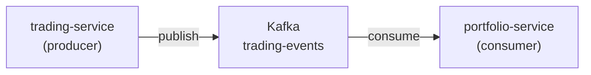

# Apache Kafka

#infrastructure #messaging #kafka #event-driven

| Параметр | Значение |
|---|---|
| Docker image | `confluentinc/cp-kafka` |
| Порт | 9092 |
| Топик | `trading-events` |
| Библиотека | `segmentio/kafka-go` |

## Роль в системе

Шина событий для асинхронного обновления портфеля после исполнения ордеров. Обеспечивает decoupling между [[trading-service]] и [[portfolio-service]].



## Топик: trading-events

| Параметр | Значение |
|---|---|
| Название | `trading-events` |
| Партиции | 1 (dev setup) |
| Replication Factor | 1 (dev setup) |
| Consumer Group | `portfolio-service` |

## Формат события

### ORDER_FILLED

```json
{
  "event_type":     "ORDER_FILLED",
  "order_id":       "550e8400-e29b-41d4-a716-446655440000",
  "user_id":        "a1b2c3d4-...",
  "symbol":         "AAPL",
  "side":           "BUY",
  "quantity":       "10.00000000",
  "price":          "150.27000000",
  "gross_amount":   "1502.70000000",
  "fee_amount":     "0.00000000",
  "execution_time": "2026-05-03T12:00:00Z"
}
```

### ORDER_REJECTED

```json
{
  "event_type": "ORDER_REJECTED",
  "order_id":   "550e8400-...",
  "user_id":    "a1b2c3d4-...",
  "symbol":     "AAPL",
  "side":       "BUY",
  "reason":     "INSUFFICIENT_FUNDS"
}
```

## Обработка в portfolio-service

При получении `ORDER_FILLED`:

| Операция | Таблица | Поле |
|---|---|---|
| BUY: уменьшить cash | `portfolios` | `cash_balance -= gross_amount` |
| BUY: увеличить позицию | `positions` | `quantity += quantity`, пересчёт `avg_price` |
| SELL: увеличить cash | `portfolios` | `cash_balance += gross_amount` |
| SELL: уменьшить позицию | `positions` | `quantity -= quantity`, `realized_pnl += (price - avg_price) * qty` |

## Пересчёт avg_price при покупке

```
new_avg_price = (old_quantity * old_avg_price + bought_quantity * bought_price)
                / (old_quantity + bought_quantity)
```

## Гарантии доставки

- At-least-once delivery (consumer коммитит offset после обработки)
- Идемпотентность обработки обеспечивается через `order_id` (дедупликация при повторном получении)

## Связанные страницы

- [[trading-service]] — публикует события
- [[portfolio-service]] — потребляет события
- [[Создание ордера]] — полный flow включая Kafka
