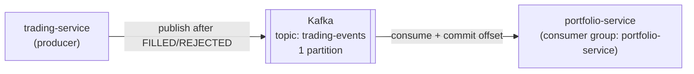
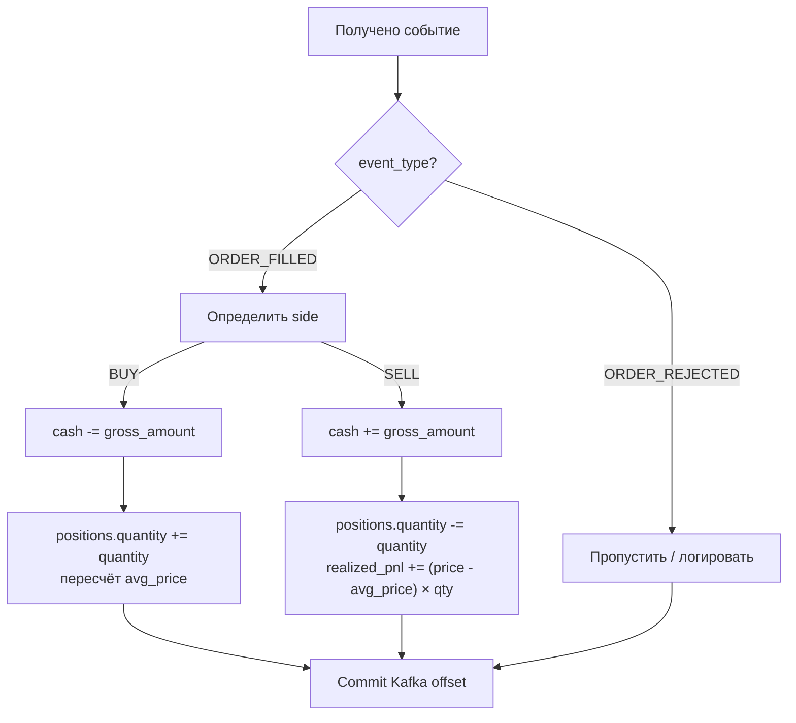

# Kafka: trading-events

#flow #kafka #events #async

## Назначение

Асинхронная связь между [[trading-service]] (producer) и [[portfolio-service]] (consumer). Позволяет не блокировать ответ клиенту на время обновления портфеля.

## Топология



## Типы событий

### ORDER_FILLED

Публикуется когда ордер успешно исполнен.

```json
{
  "event_type":     "ORDER_FILLED",
  "order_id":       "550e8400-e29b-41d4-a716-446655440000",
  "user_id":        "a1b2c3d4-e5f6-7890-abcd-ef1234567890",
  "symbol":         "AAPL",
  "side":           "BUY",
  "quantity":       "10.00000000",
  "price":          "150.30000000",
  "gross_amount":   "1503.00000000",
  "fee_amount":     "0.00000000",
  "execution_time": "2026-05-03T12:00:00.000Z"
}
```

### ORDER_REJECTED

Публикуется когда ордер отклонён.

```json
{
  "event_type": "ORDER_REJECTED",
  "order_id":   "550e8400-...",
  "user_id":    "a1b2c3d4-...",
  "symbol":     "AAPL",
  "side":       "BUY",
  "quantity":   "10.00000000",
  "reason":     "NO_LIQUIDITY",
  "timestamp":  "2026-05-03T12:00:00.000Z"
}
```

**Значения `reason`:**
| Значение | Описание |
|---|---|
| `NO_LIQUIDITY` | Недостаточный объём в стакане |
| `INSUFFICIENT_FUNDS` | Недостаточно денег (BUY) |
| `INSUFFICIENT_POSITION` | Недостаточно актива (SELL) |

## Обработка в portfolio-service



## Гарантии и идемпотентность

| Аспект | Реализация |
|---|---|
| Гарантия доставки | At-least-once |
| Дедупликация | По `order_id` (upsert вместо insert) |
| Порядок сообщений | Гарантирован в рамках одной партиции |
| Consumer group | `portfolio-service` — один экземпляр читает партицию |

> [!warning] At-least-once
> Если portfolio-service упадёт после обработки, но до коммита offset — событие придёт снова. Логика обновления должна быть идемпотентной.

## Конфигурация

**Producer (trading-service):**
```
KAFKA_BROKERS=kafka:9092
Topic: trading-events
Acks: all (подтверждение от лидера)
```

**Consumer (portfolio-service):**
```
KAFKA_BROKERS=kafka:9092
KAFKA_GROUP_ID=portfolio-service
Topic: trading-events
Auto-offset: earliest (при первом старте)
```

## Связанные страницы

- [[trading-service]] — producer
- [[portfolio-service]] — consumer
- [[Создание ордера]] — контекст когда публикуется событие
- [[Kafka]] — инфраструктура брокера
