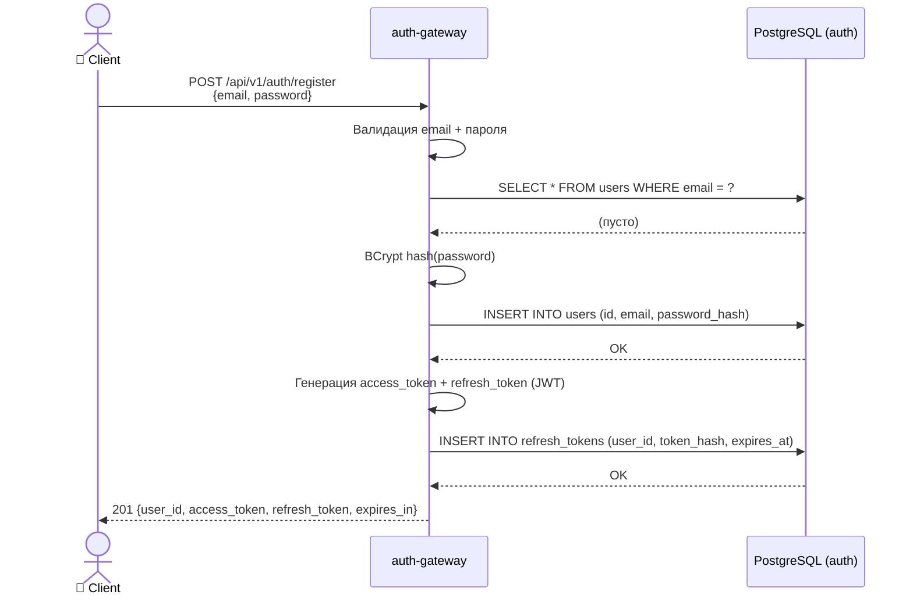
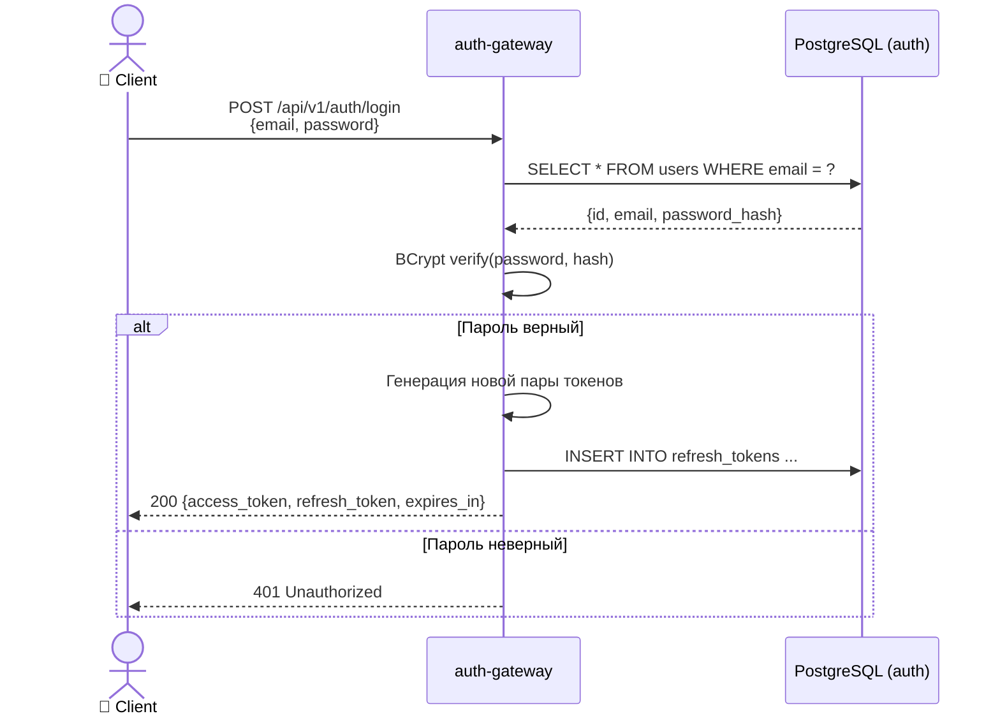
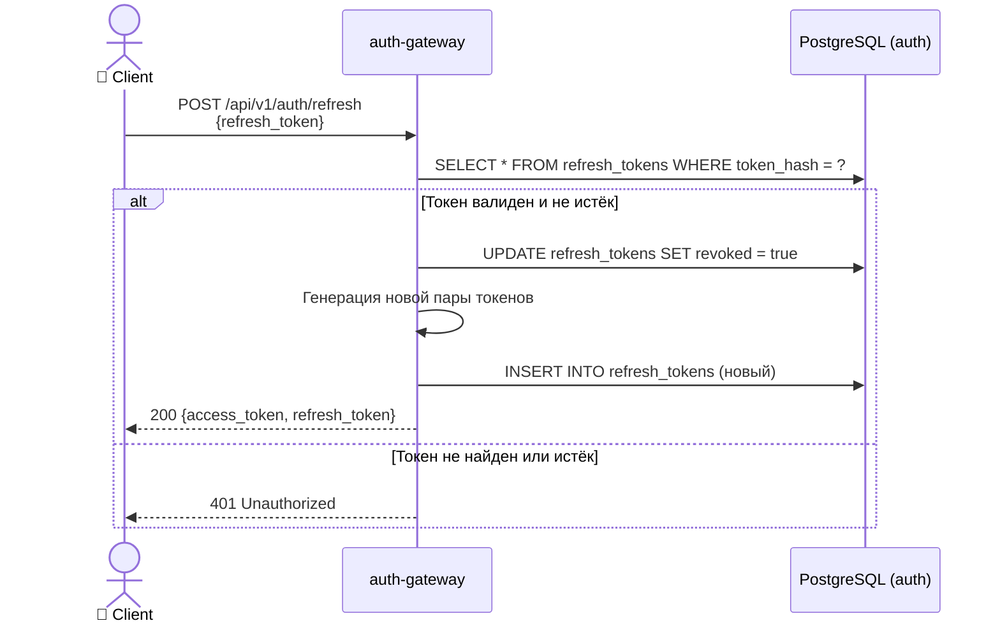
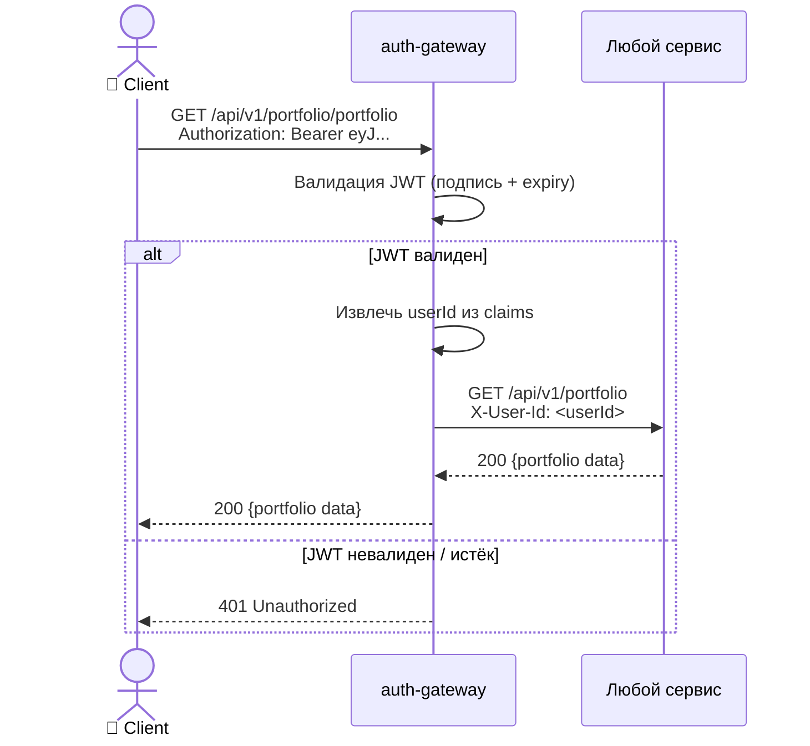

# Регистрация и логин

#flow #auth #sequence

## Регистрация

## Логин

## Обновление токена

## Авторизованный запрос к бизнес-сервису

## Связанные страницы

- [[auth-gateway]] — детали сервиса
- [[Auth API]] — эндпоинты
- [[PostgreSQL]] — схема auth DB
