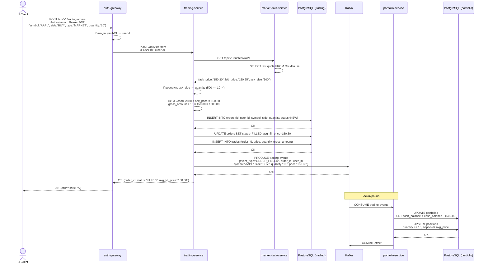
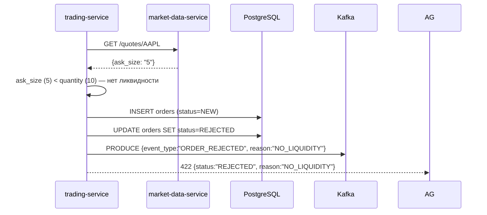

# Создание ордера (end-to-end)

#flow #trading #sequence #critical-path

Главный бизнес-сценарий платформы: пользователь покупает/продаёт актив.

## Полный sequence diagram

## Сценарий SELL

Отличается от BUY в следующих шагах:
1. Цена исполнения = `bid_price` (не `ask_price`)
2. portfolio-service: `cash_balance += gross_amount`
3. portfolio-service: `positions.quantity -= quantity`
4. portfolio-service: `positions.realized_pnl += (price - avg_price) × quantity`

## Сценарий: ордер отклонён

## Временные характеристики

| Шаг | Ожидаемое время |
|---|---|
| Валидация JWT | ~1 ms |
| Запрос котировки | ~15 ms |
| Запись в PostgreSQL | ~5-10 ms |
| Публикация в Kafka | ~3-5 ms |
| **Итого (синхронная часть)** | **~25-35 ms** |
| Обновление портфеля (async) | ~10-20 ms |

## Связанные страницы

- [[trading-service]] — исполнение ордеров
- [[portfolio-service]] — обновление портфеля
- [[Kafka trading-events]] — формат события
- [[Trading API]] — эндпоинт POST /orders
- [[Portfolio API]] — как проверить результат
